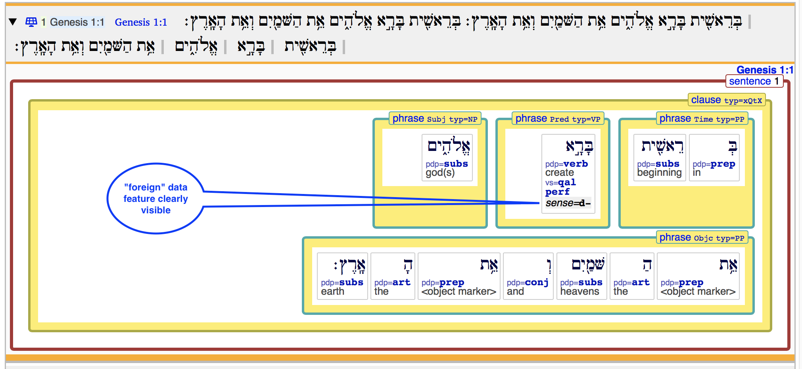
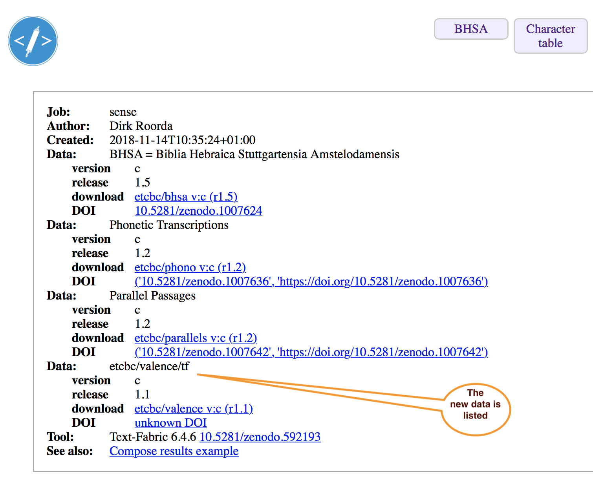

# Adding data modules

Text-Fabric support the flow of creating research data,
packaging it, distributing it, and importing it easily.

## Assumptions

The data sharing workflow is built around the following assumptions:

??? note "main corpus app"
    You work with a main corpus for which a text-fabric app is available.
    See [Corpora](Corpora.md)

??? note "versioned tf data"
    The data you share consists of a set of TF features, tied to a specific
    *version* of the main corpus, preferably the most recent version.
    The new features must sit in a directory named after the version
    of the main corpus they correspond to.

    ??? example "BHSA"
        For the *BHSA*, that would be version *c*.
        You can also produce data for multiple versions.

??? note "local github"
    The data you share must reside in a directory on your hard drive.
    The convention is, that you have a directory `github` under your
    home directory. And inside `github`, you have directories for
    organizations or people first, and then repositories, exactly as 
    the online GitHub is organized. 

    ??? example "BHSA"
        If you have the BHSA repo, its versioned TF feature directories
        should be under `~/github/etcbc/bhsa/tf`

    Your own data should be in such a repo as well, e.g.

    `ch-jensen/Semantic-mapping-of-participants/actor/tf`

    or

    `etcbc/lingo/heads/tf`

??? note "synchronized with GitHub"
    You must have your local repo contents synchronized with that on GitHub

??? note "online GitHub"
    Before you share your data, you must make a *release* on GitHub.
    Then you must attach your features as a zip file to that release.
    Text-Fabric has a command to produce a zip file with exactly the
    right structure and name.

??? note "get data"
    In order to get data, the only thing Text-Fabric needs to know,
    is a string with the organisation or person, the repository,
    and the path within the repository.

    Based on the string `{org}/{repo}/{path}` it will find the online
    repository, check the latest release, find the zip file,
    download and expand it to your local
    `~/text-fabric/data/{org}/{repo}/{path}`
    
??? note "everywhere"
    The extra data is accessible whether you work in a Jupyter notebook,
    or in the Text-Fabric browser.
    The extra features are clearly listed after the incantation in a notebook,
    and they show up in the pretty displays in the TF browser.
    And when you export data from the TF browser, all data modules afe reported
    in the provenance section.

## Step by step

### 1. Data in place

We use the existing [etcbc/valence/tf](https://github.com/etcbc/valence) data as an example.

We assume you have this data locally, in 

```
~/github/etcbc/valence/tf
```

under which there are versions such as `c`, `2017`, which contain the actual `.tf` files.

### 2. Package into zip files

To create zip files for the data, execute the following command in your terminal:

```sh
text-fabric-zip etcbc/valence/tf
```

You'll see

```
zipping etcbc/valence             2016 with  10 features
zipping etcbc/valence             2017 with  10 features
zipping etcbc/valence                4 with  10 features
zipping etcbc/valence               4b with  10 features
zipping etcbc/valence                c with  10 features
```

and as a result you have this in your Downloads folder

```
~/Downloads/etcbc-release/valence/
    tf-4.zip
    tf-4b.zip
    tf-2016.zip
    tf-2017.zip
    tf-c.zip
```
        
### 3. Make a release

Locally, commit your changes and push them to GitHub

```sh
git add --all .
git commit -m "releasing data"
git push origin master
```

**You can only do this for repositories for which you have write access,
so do not try to perform this on `etcbc/valence` but use a repo of your own.**

Go to the online version on GitHub, and click *releases*


Then click *Draft a new release*


Fill in the details, especially the version (something like `1.6`),
although nothing in the workflow depends on the exact form of the version number;
you will see the release version in the provenance, though.

Do not forget to select your freshly made zip files
(you can select and upload them in one go).

Last, but not least, click the button *Publish release*.


Now your data is available to others.

### 4. Use data

The valence data has been made available by the ETCBC, so the following steps
you can perform literally.

#### In the TF browser

Start the TF browser as follows:

```sh
text-fabric bhsa --mod=etcbc/valence/tf
```

You will see that the valence data is being used.
If you do not have `~/github/etcbc/valence/tf`
nor `~/text-fabric-data/etcbc/valence/tf`
data will be downloaded and expanded to the
latter location.

??? note "output when loading new data"
    ```
    Setting up TF kernel for bhsa etcbc/valence/tf
    Using etcbc/bhsa - c r1.5 in ~/text-fabric-data/etcbc/bhsa/tf/c
    Using etcbc/phono - c r1.2 in ~/text-fabric-data/etcbc/phono/tf/c
    Using etcbc/parallels - c r1.2 in ~/text-fabric-data/etcbc/parallels/tf/c
      downloading etcbc/valence - c r1.1
      from https://github.com/etcbc/valence/releases/download/1.1/tf-c.zip ...
      unzipping ...
      saving etcbc/valence - c r1.1
      saved etcbc/valence - c r1.1
    Using etcbc/valence - c r1.1 (=latest) in ~/text-fabric-data/etcbc/valence/tf/c
       |     0.29s T cfunction            from /Users/dirk/text-fabric-data/etcbc/valence/tf/c
       |     0.23s T f_correction         from /Users/dirk/text-fabric-data/etcbc/valence/tf/c
       |     0.46s T grammatical          from /Users/dirk/text-fabric-data/etcbc/valence/tf/c
       |     0.31s T lexical              from /Users/dirk/text-fabric-data/etcbc/valence/tf/c
       |     0.23s T original             from /Users/dirk/text-fabric-data/etcbc/valence/tf/c
       |     0.46s T predication          from /Users/dirk/text-fabric-data/etcbc/valence/tf/c
       |     0.23s T s_manual             from /Users/dirk/text-fabric-data/etcbc/valence/tf/c
       |     0.31s T semantic             from /Users/dirk/text-fabric-data/etcbc/valence/tf/c
       |     0.14s T sense                from /Users/dirk/text-fabric-data/etcbc/valence/tf/c
       |     0.47s T valence              from /Users/dirk/text-fabric-data/etcbc/valence/tf/c
    TF setup done.
    ```

If you run it a second time, all data is in place.

??? note "output when all data is in place"
    ```
    Setting up TF kernel for bhsa etcbc/valence/tf
    Using etcbc/bhsa - c r1.5 in ~/text-fabric-data/etcbc/bhsa/tf/c
    Using etcbc/phono - c r1.2 in ~/text-fabric-data/etcbc/phono/tf/c
    Using etcbc/parallels - c r1.2 in ~/text-fabric-data/etcbc/parallels/tf/c
    Using etcbc/valence - c r1.1 in ~/text-fabric-data/etcbc/valence/tf/c
    TF setup done.
    ```

If you have reasons to think that there is a new release of any of the data
involved, you can pass the `-c` switch:

```sh
text-fabric bhsa --mod=etcbc/valence/tf -c
```

??? note "output when all checking for data updates"
    ```
    Loading data for bhsa. Please wait ...
    Setting up TF kernel for bhsa etcbc/valence/tf
    No new data release available online.
    Using bhsa - c r1.5 (=latest) in ~/text-fabric-data/etcbc/bhsa/tf/c.
    No new data release available online.
    Using phono - c r1.2 (=latest) in ~/text-fabric-data/etcbc/phono/tf/c.
    No new data release available online.
    Using parallels - c r1.2 (=latest) in ~/text-fabric-data/etcbc/parallels/tf/c.
    No new data release available online.
    Using valence - c r1.1 (=latest) in ~/text-fabric-data/etcbc/valence/tf/c.
    TF setup done.
    ```

And if there is a new release for the valence data, it will be downloaded.

??? note "output when updating a data module"
    ```
    Setting up TF kernel for bhsa etcbc/valence/tf
    No new data release available online.
    Using bhsa - c r1.5 (=latest) in ~/text-fabric-data/etcbc/bhsa/tf/c.
    No new data release available online.
    Using phono - c r1.2 (=latest) in ~/text-fabric-data/etcbc/phono/tf/c.
    No new data release available online.
    Using parallels - c r1.2 (=latest) in ~/text-fabric-data/etcbc/parallels/tf/c.
      downloading etcbc/valence - c r1.1
      from https://github.com/etcbc/valence/releases/download/1.1/tf-c.zip ...
      unzipping ...
      saving etcbc/valence - c r1.1
      saved etcbc/valence - c r1.1
    Using etcbc/valence - c r1.1 (=latest) in ~/text-fabric-data/etcbc/valence/tf/c
       |     0.30s T cfunction            from /Users/dirk/text-fabric-data/etcbc/valence/tf/c
       |     0.23s T f_correction         from /Users/dirk/text-fabric-data/etcbc/valence/tf/c
       |     0.47s T grammatical          from /Users/dirk/text-fabric-data/etcbc/valence/tf/c
       |     0.32s T lexical              from /Users/dirk/text-fabric-data/etcbc/valence/tf/c
       |     0.23s T original             from /Users/dirk/text-fabric-data/etcbc/valence/tf/c
       |     0.47s T predication          from /Users/dirk/text-fabric-data/etcbc/valence/tf/c
       |     0.23s T s_manual             from /Users/dirk/text-fabric-data/etcbc/valence/tf/c
       |     0.32s T semantic             from /Users/dirk/text-fabric-data/etcbc/valence/tf/c
       |     0.14s T sense                from /Users/dirk/text-fabric-data/etcbc/valence/tf/c
       |     0.49s T valence              from /Users/dirk/text-fabric-data/etcbc/valence/tf/c
    TF setup done.
    ```

You can now use the new features in the TF browser.

Fill out this query:

```
book book=Genesis
  chapter chapter=1
    clause
      phrase sense*
```

and expand the first result in Genesis 1:1.

The display looks like this:



And if you export the data, the extra module is listed in the provenance.



##### More modules

Now that we get the hang of it, we would like to use the `heads` feature
that Cody Kingham prepared in [etcbc/lingo/heads](https://github.com/ETCBC/lingo/tree/master/heads).
We'll include it next to the valence data, by calling the TF browser like this:

```sh
text-fabric bhsa --mod=etcbc/valence/tf,etcbc/lingo/heads/tf
```

Unsurprisingly: the `heads` feature and friends are downloaded and made ready for import.

You can test it by means of this query

```
book book=Genesis
  chapter chapter=1
    clause
      phrase sense*
      -heads> word
```

Note that `heads` is an edge feature.


#### In a Jupyter notebook

**N.B. The incantation has been changed. Read more in the [v7 guide](Use7.md)**.

```python
from tf.app import use
A = use('bhsa', mod='etcbc/valence/tf,etcbc/lingo/heads/tf', hoist=globals())
```


Now run the same query as before:

```
results = A.search('''
book book=Genesis
  chapter chapter=1
    clause
      phrase sense*
      -heads> word
'''
)
```

And let's see results in pretty display.
We have to manually declare that we want to see the `sense` feature.

```
A.prettySetup(features='sense')
A.show(results, start=1, end=1)
```

See the
[share](https://nbviewer.jupyter.org/github/etcbc/bhsa/blob/master/tutorial/share.ipynb)
tutorial.
