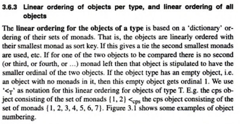

# Navigating nodes

??? abstract "N()"
    ```python
    for n in N():
        action
    ```

    ???+ info "Description"
        The result of `N()` is a generator that walks through all nodes in the
        *canonical order* (see below).
        Iterating over `N()` delivers you all words and structural elements of
        your corpus in a very natural order.

    ??? explanation "Walking nodes"
        Most processing boils down to walking through the nodes by visiting node sets in
        a suitable order. Occasionally, during the walk you might want to visit
        embedding or embedded nodes to glean some feature information from them.

    ??? hint "More ways of walking"
        Later, under *Features* there is another convenient way to walk through
        nodes.

??? explanation "canonical order"
    The canonical order is a way to sort the nodes in your corpus in such a way
    that you can enumerate all nodes in the order you encounter them if you
    walk through your corpus.

    Briefly this means:

    *   embedder nodes come before the nodes that lie embedded in them;
    *   earlier stuff comes before later stuff,
    *   if a verse coincides with a sentence, the verse comes before the sentence,
        because verses generally contain sentences and not the other way round;
    *   if two objects are intersecting, but none embeds the other, the one with the
        smallest slot that does not occur in the other, comes first.

    ??? example "first things first, big things first"
        That means, roughly, that you start with a
        book node (Genesis), then a chapter node (Genesis 1), then a verse node, Genesis
        1:1, then a sentence node, then a clause node, a phrase node, and the first word
        node. Then follow all word nodes in the first phrase, then the phrase node of
        the second phrase, followed by the word nodes in that phrase. When ever you
        enter a higher structure, you will first get the node corresponding to that
        structure, and after that the nodes corresponding to the building blocks of that
        structure.

    This concept follows the intuition that slot sets with smaller elements come
    before slot set with bigger elements, and embedding slot sets come before
    embedded slot sets. Hence, if you enumerate a set of nodes that happens to
    constitute a tree hierarchy based on slot set embedding, and you enumerate those
    nodes in the slot set order, you will walk the tree in pre-order.

    This order is a modification of the one as described in (Doedens 1994, 3.6.3).

    

    > Doedens, Crist-Jan (1994), *Text Databases. One Database Model and Several
    > Retrieval Languages*, number 14 in Language and Computers, Editions Rodopi,
    > Amsterdam, Netherlands and Atlanta, USA. ISBN: 90-5183-729-1,
    > <{{doedens}}>. The order as defined by
    > Doedens corresponds to walking trees in post-order.

    For a lot of processing, it is handy to have a the stack of embedding elements
    available when working with an element. That is the advantage of pre-order over
    post-order. It is very much like SAX parsing in the XML world.


??? abstract "sortNodes()"
    ```python
    sortNodes(nodeSet)
    ```

    ???+ info "Description"
        delivers an iterable of nodes as a tuple sorted by the *canonical ordering*.

    ??? info "nodeSet"
        An iterable of nodes to be sorted.

??? abstract "sortKey"
    ```python
    nodeList = sorted(nodes, key=sortKey)
    ```

    ???+ info "Description"
        A function that provides for each node the key to be used to sort nodes in the
        canonical ordering. That means that the following two pieces of code do the same
        thing:

        `sortNodes(nodeSet)` and `sorted(nodeSet, key=sortKey)`.

??? abstract "sortKeyTuple"
    ```python
    tupleList = sorted(tuples, key=sortKeyTuple)
    ```

    ???+ info "Description"
        Same as `sortKey`, but this one works on tuples instead of nodes.
        It appies `sortKey` to each member of the tuple.
        Handy to sort e.g. search results. We
        could sort them in canonical order like this:

        ```python
        sorted(results, key=lambda tup: tuple(sortKey(n) for n in tup))
        ```

        This is exactly what `sortKeyTuple` does, but then a bit more efficient.

??? abstract "otypeRank"
    ```python
    otypeRank['sentence']
    ```
    The node types are ordered in `C.levels.data`, and if you reverse that list, you get
    the rank of a type by looking at the position in which that type occurs.

    The *slotType* has otypeRank 0, and the more comprehensive a type is, the higher its rank.
    
