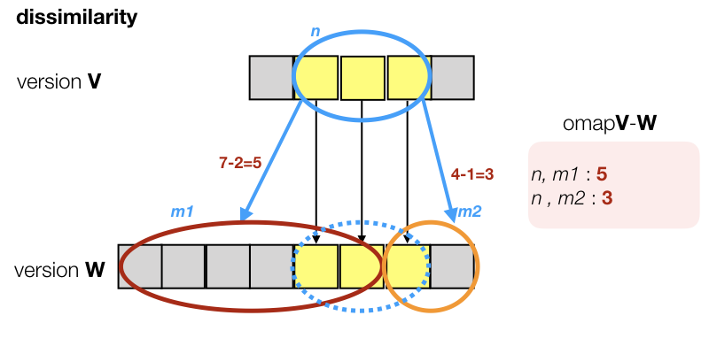

# Nodemaps

When different versions of a TF dataset exist, it makes sense to map the nodes from the older version
to nodes of the newer version.

If we have annotations on the older version (possibly created with considerable man-machine labor),
we can use such node mappings to transfer the annotations to the newer version without redoing all
the work.

Mapping the nodes consists of two stages:

1. **slot mapping** This is very dependent on what happened between versions.
2. **node mappings per node type** These can be generically constructed once we have a slot mapping.

This module contains the function `makeVersionMapping` which is a function to furnish node mappings
for node types given a slot mapping exists.

# Nodes in general
The basic idea we use for the general case is that that nodes are linked to slots. 
In text-fabric, the standard `oslots` edge feature lists for each non-slot node the slots it is linked to.

Combining the just created slot mappings between versions and the `oslots` feature,
we can extend the slot mapping into a general node mapping.

In order to map a node \(n\) in version \(V\), we look at its slots \(s\),
use the already established *slot mapping* to map these to slots \(t\) in version \(W\),
and collect the nodes \(m\) in version \(W\) that are linked to those \(t\).
They are good candidates for the mapping.


# Refinements

When we try to match nodes across versions, based on slot containment, we also respect
their `otype`s. So we will not try to match a `clause` to a `phrase`.
We make implicit use of the fact that for most `otype`s, the members contain disjoint slots.

# Multiple candidates
Of course, things are not always as neat as in the diagram. Textual objects may have split, or shifted,
or collapsed.
In general we find 0 or more candidates. 
Even if we find exactly one candidate, it does not have to be a perfect match.
A typical situation is this:



We do not find a node \(m\in W\) that occupies the mapped slots exactly.
Instead, we find that the target area is split between two candidates who
also reach outside the target area.

In such cases, we make edges to all such candidates, but we add a dissimilarity measure.
If \(m\) is the collection of slots, mapped from \(n\), and \(m_1\) is a candidate for \(n\), meaning \(m_1\) has
overlap with \(m\), then the *dissimilarity* of \(m_1\) is defined as:

$$|m_1\cup m| - |m_1\cap m|$$

In words: the number of slots in the union of \(m_1\) and \(m\) minus the number of slots in their intersection.

In other words: \(m_1\) gets a penalty for

* each slot \(s\in m_1\) that is not in the mapped slots \(m\);
* each mapped slot \(t\in m\) that is not in \(m_1\).

If a candidate occupies exactly the mapped slots, the dissimilarity is 0.
If there is only one such candidate of the right type, the case is completely clear, and we
do not add a dissimilarity value to the edge.

If there are more candidates, all of them will get an edge, and those edges will contain the dissimilarity
value, even if that value is \(0\).


# Diagnostic labels
We report the success in establishing the match between non-slot nodes.
We do so per node type, and for each node type we list a few statistics,
both in absolute numbers and in percentage of the total amount of nodes of that
type in the source version.

We count the nodes that fall in each of the following cases.
The list of cases is ordered by decreasing success of the mapping.

*   `b` **unique, perfect**:
    there is only one match for the mapping and it is a perfect one
    in terms of slots linked to it;
*   `d`
    **multiple, one perfect**:
    there are multiple matches, but at least one is perfect;
    this occurs typically if nodes of a type are linked to nested
    and overlapping sequences of slots;
*   `c`
    **unique, imperfect**:
    there is only one match, but it is not perfect;
    this indicates that some boundary reorganization has happened between the two versions,
    and that some slots of the source node have been cut off in the target node;
    yet the fact that the source node and the target node correspond is clear;
*   `f`
    **multiple, cleanly composed**:
    in this case the source node corresponds to a bunch of matches,
    which together cleanly cover the mapped slots of the source node;
    in other words: the original node has been split in several parts;
*   `e`
    **multiple, non-perfect**:
    all remaining cases where there are matches;
    these situations can be the result of more intrusive changes;
    if it turns out to be a small set they do require closer inspection;
*   `a`
    **not mapped**:
    these are nodes for which no match could be found.


An involved example of creating node mappings between versions (not using this code) is
[versionMappings.ipynb](https://nbviewer.jupyter.org/github/ETCBC/bhsa/blob/master/programs/versionMappings.ipynb).

A simpler example, using this code is
[map.ipynb](https://nbviewer.jupyter.org/github/Dans-labs/clariah-gm/blob/master/programs/map.ipynb).

## Usage

```python
from tf.compose import Versions

V = Versions(api, va, vb, slotMap)
V.makeVersionMapping()
```
