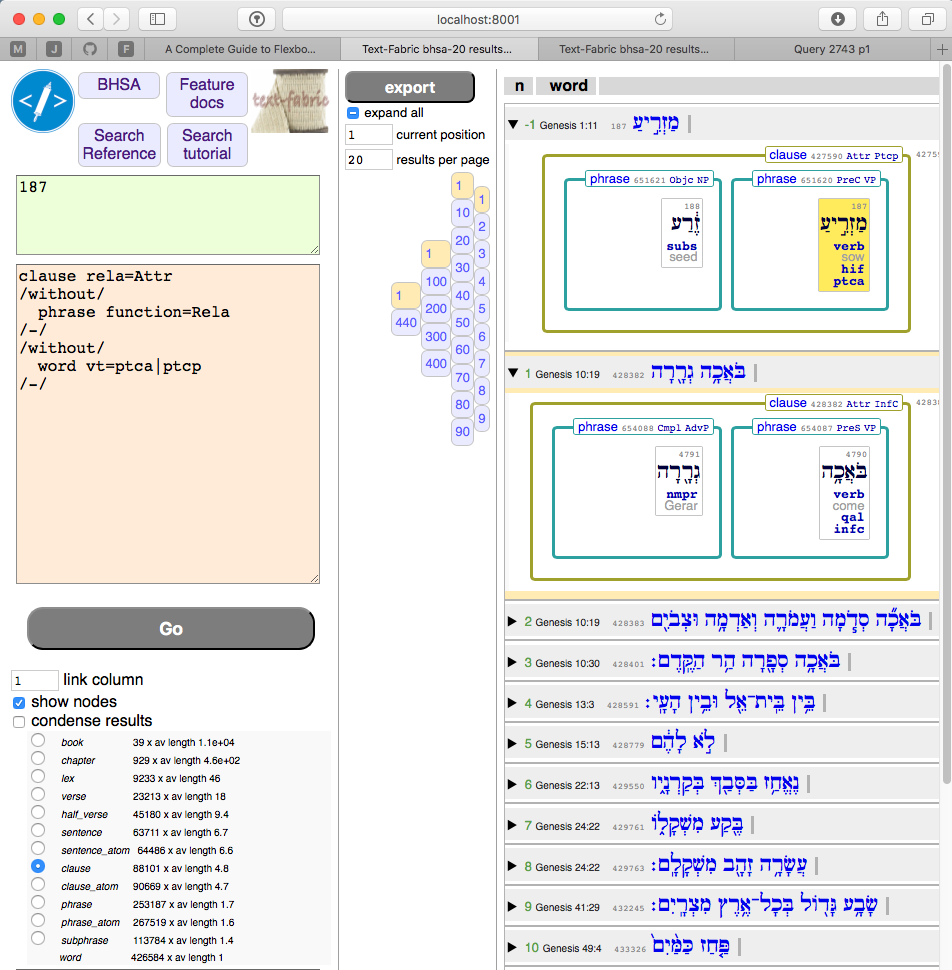
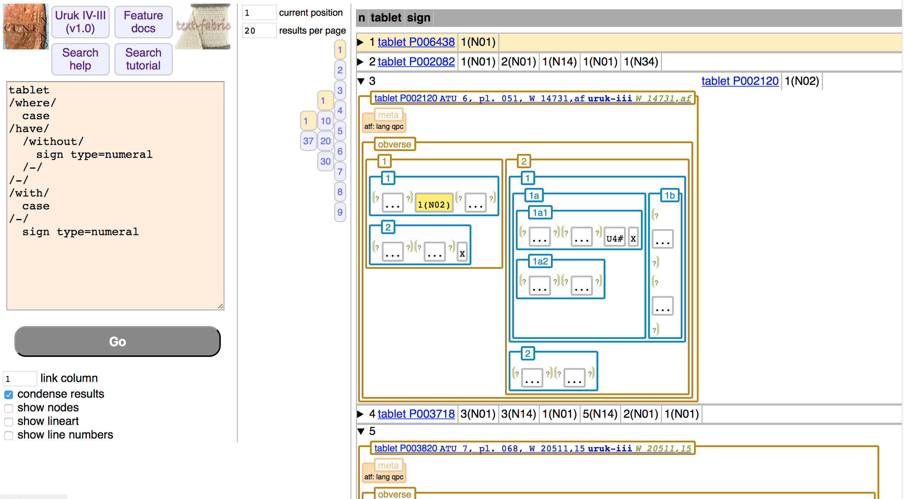

Text-Fabric is several things:

* a *browser* for ancient text corpora
* a Python3 package for processing ancient corpora

A corpus of ancient texts and linguistic annotations represents a large body of knowledge.
Text-Fabric makes that knowledge accessible to non-programmers by means of 
built-in a search interface that runs in your browser.

From there the step to program your own analytics is not so big anymore.
Because you can call the Text-Fabric API from your Python programs, and
it works really well in Jupyter notebooks.
 
# Install

Text Fabric is a Python(3) package on the Python Package Index, so you can install it easily with `pip` from
the command line.

???+ abstract "Python"
    Install or upgrade [Python3](https://www.python.org/downloads/) on your system to at least version 3.6.

??? hint "Jupyter"
    Optionally install [Jupyter](http://jupyter.org) as well:

    ```sh
    pip3 install jupyter
    ```

    ???+ hint "Jupyter Lab"
        *Jupyter lab* is a nice context to work with Jupyter notebooks.
        Recommended for working with the
        the tutorials of Text-Fabric.
        Also when you want to copy and paste cells from one notebook
        to another.

        ```sh
        pip3 install jupyterlab
        jupyter labextension install jupyterlab-toc
        ```

        The toc-extension is handy to get an overview
        when working with the lengthy tutorial. It will create an extra
        tab in the Jupyter Lab interface with a table of contents of the
        current notebook.

???+ abstract "Text-Fabric"
    Install Text-Fabric:

    ```sh
    pip3 install text-fabric
    ```

# Get corpora

There are a few corpora in Text-Fabric that are being supported
with extra modules.

??? abstract "Hebrew Bible"
    Get the corpus:

    ```sh
    cd ~/github/etcbc
    git clone https://github.com/etcbc/bhsa
    ```

??? abstract "Cuneiform tablets from Uruk"
    Get the corpus:

    ```sh
    cd ~/github/Nino-cunei
    git clone https://github.com/Nino-cunei/uruk
    ```

??? hint "More"
    The
    [Greek](https://github.com/Dans-labs/text-fabric-data/tree/master/greek/sblgnt) and
    [Syriac](https://github.com/ETCBC/linksyr/tree/master/data/tf/syrnt)
    New Testament have been converted to TF.

    We have example corpora in Sanskrit, and Babylonian.

    ```sh
    cd ~/github
    git clone https://github.com/etcbc/linksyr
    ```

    ```sh
    cd ~/github
    git clone https://github.com/Dans-labs/text-fabric-data
    ```

    All these are not supported by extra innterfaces.

# Use the built-in search interface

Provided you have the data repositories for the Hebrew Bible (bhsa) or the Proto-Cuneiform Uruk corpus (cunei)
in place (see below),
you can open a terminal (command prompt), and just say

```sh
text-fabric bhsa
```

or 

```sh
text-fabric cunei
```

After loading the data your browser will open and load the search interface.
There you'll find links to further help.

<p>

</p>

<p>

</p>


???+ hint "Multiple windows"
    After you have issued the `text-fabric` command, you can open many connections
    in different browsers and windows and tabs.
    They all use the same data, which only gets loaded when the command `text-fabric` is run.
    If you leave it on all day, you have instant access to the data.

??? hint "Close"
    You can close the data server by pressing Ctrl-C in the terminal where you have
    started `text-fabric` up.

# Frequently Occurring Trouble

??? caution "Older versions"
    Older versions of Python and Text-Fabric may be in the way.
    The following hygenic measures are known to be beneficial:

    ??? abstract "Python related"
        When you have upgraded Python, remove PATH statements for older versions from your system startup files.
      
        * For the Macos: look at `.bashrc`, `.bash_profile` in your home directory.
        * For Windows: on the command prompt, say `echo %path%` to see what the content of your PATH
          variable is. If you see references to older versions of python than you actually work with,
          they need to be removed. [Here is how](https://www.computerhope.com/issues/ch000549.htm)
        
        ???+ caution "Only for Python3"
            Do not remove references to Python 2.*, but only outdated Python 3.* versions. 

    ??? abstract "Text-Fabric related"
        Sometimes `pip3 uninstall text-fabric` fails to remove all traces of Text-Fabric.
        Here is how you can remove them manually:

        * locate the `bin` directory of the current Python, it is something like

          * (Macos regular Python) `/Library/Frameworks/Python.framework/Versions/3.7/bin`
          * (Windows Anaconda) `C:\Users\You\Anaconda3\Scripts`

          Remove the file `text-fabric` from this directory if it exists.

        * locate the `site-packages` directory of the current Python, it is something like

          * (Macos regular Python)
            `/Library/Frameworks/Python.framework/Versions/3.7/lib/python3.7/site-packages`

            Remove the subdirectory `tf` from this location, plus all files with `text-fabric` in the name.

        * After this, you can make a fresh install of `text-fabric`:

          ```sh
          pip3 install text-fabric
          ```

??? caution "Newest version of Text-Fabric does not show up"
    When you get errors doing `pip3 install text-fabric`, there is probably an older version around.
    You have to say

    ```sh
    pip3 install --upgrade text-fabric
    ```

    If this still does not download the most recent version of `text-fabric`, it may have been cauched by caching.
    Then say:

    ```sh
    pip3 install --upgrade --no-cache-dir text-fabric
    ```

    You can check what the newest distributed version of Text-Fabric is on
    [PyPi](https://pypi.org/project/text-fabric/).


# Documentation

There is extensive documentation.
If you start using the Text-Fabric API in your programs, you'll need it.

??? note "Reference"
    The pages you are reading now are the reference docs.

    * It explains the [data model](https://dans-labs.github.io/text-fabric/Model/Data-Model/)
    * It specifies the [file format](https://dans-labs.github.io/text-fabric/Model/File-formats/)
    * It holds the [api docs](https://dans-labs.github.io/text-fabric/Api/General/)
   
???+ note "Tutorials"
    There are tutorials and exercises to guide you into increasingly involved tasks
    on specific corpora (outside this repo):

    * [Biblia Hebraica Stuttgartensia Amstelodamensis](https://nbviewer.jupyter.org/github/etcbc/bhsa/blob/master/tutorial/start.ipynb)
    * [Proto-Cuneiform tablets from Uruk IV/III](https://nbviewer.jupyter.org/github/nino-cunei/tutorials/blob/master/start.ipynb)

??? note "Background"
    For more background information (earlier work, institutes, people, datasets), consult the
    [wiki](https://github.com/ETCBC/shebanq/wiki) pages of SHEBANQ.

??? note "Papers"
    Papers (preprints on [arxiv](https://arxiv.org)), most of them published:

    * [Parallel Texts in the Hebrew Bible, New Methods and Visualizations ](https://arxiv.org/abs/1603.01541)
    * [The Hebrew Bible as Data: Laboratory - Sharing - Experiences](https://www.ubiquitypress.com/site/chapters/10.5334/bbi.18/)
       (preprint: [arxiv](https://arxiv.org/abs/1501.01866))
    * [LAF-Fabric: a data analysis tool for Linguistic Annotation Framework with an application to the Hebrew Bible](https://arxiv.org/abs/1410.0286)
    * [Annotation as a New Paradigm in Research Archiving](https://arxiv.org/abs/1412.6069)

??? note "Presentation"
    Here is a motivational
    [presentation](http://www.slideshare.net/dirkroorda/text-fabric),
    given just before
    [SBL 2016](https://global-learning.org/mod/forum/discuss.php?d=22)
    in the Lutheran Church of San Antonio.


# Getting started with the API

Start programming: write a python script or code in the Jupyter notebook

```sh
cd somewhere-else
jupyter notebook
```

Enter the following text in a code cell

```python
from tf.fabric import Fabric
TF = Fabric(modules=['my/dataset'])
api = TF.load('sp lex')
api.makeAvailableIn(globals())
```

??? note "locations"
    Maybe you have to tell Text-Fabric exactly where your data is.
    If you have the data in a directory `text-fabric-data`
    under your home directory  or under `~/github`, Text-Fabric can find it.
    In your `modules` argument you then specify one or more subdirectories of
    `text-fabric-data`.

??? abstract "Using Hebrew data"
    To get started with the Hebrew corpus, use its tutorial in the BHSA repo:
    [start](http://nbviewer.jupyter.org/github/etcbc/bhsa/blob/master/tutorial/start.ipynb).

    Or go straight to the
    [bhsa-api-docs](/Api/Bhsa).

??? abstract "Using Cuneiform data"
    To get started with the Uruk corpus, use its tutorial in the Nino-cunei repo:
    [start](http://nbviewer.jupyter.org/github/nino-cunei/tutorials/blob/master/start.ipynb).

    Or go straight to the
    [cunei-api-docs](/Api/Cunei).

# Design principles

??? abstract "Minimalistic model"
    Text-Fabric is based on a minimalistic data model for text plus annotations.

    A defining characteristic is that Text-Fabric does not make use of XML or JSON,
    but stores text as a bunch of features in plain text files.

    These features are interpreted against a *graph* of nodes and edges, which make up the
    abstract fabric of the text.

??? abstract "Efficient data processing"
    Based on this model, Text-Fabric offers a [processing API](/Api/General/)
    to search, navigate and process text and its annotations.

??? abstract "Search for patterns"
    The [search API](/Api/Genral/#searching)
    works with search templates that define relational patterns
    which will be instantiated by nodes and edges of the fabric.

??? abstract "Sharing data"
    [easy sharing of sharing data](/Api/General/#loading)
    Students can pick and choose the feature data they need.
    When the time comes to share the fruits of their thought,
    they can do so in various ways:

    * when using the TF browser, results can be exported as PDF and stored
      in a repository[
    * when programming in a notebook, these notebooks can easily be shared online
      by using GitHub of NBViewer.

??? abstract "Contributing data"
    Researchers can easily
    [produce new data modules](/Api/General/#saving-features)
    of text-fabric data out of their findings.

??? abstract "Factory"
    Text-Fabric can be and has been used to construct websites,
    for example [SHEBANQ](https://shebanq.ancient-data.org).
    In the case of SHEBANQ, data has been converted to mysql databases.
    However, with the built-in data server, it is also possible to
    have one Text-Fabric process serve multiple connections and requests.

???+ explanation "History"
    The foundational ideas derive from work done in and around the
    [ETCBC](http://etcbc.nl)
    by Eep Talstra, Crist-Jan Doedens, Henk Harmsen, Ulrik Sandborg-Petersen
    and many others.

    The author entered in that world in 2007 as a 
    [DANS](https://www.dans.knaw.nl) employee, doing a joint small data project,
    and a bigger project SHEBANQ in 2013/2014.
    In 2013 I developed
    [LAF-Fabric](https://github.com/Dans-labs/laf-fabric)
    in order to be able to construct the website
    [SHEBANQ](https://shebanq.ancient-data.org).

    I have taken out everything that makes LAF-Fabric complicated and
    all things that are not essential for the sake of raw data processing.

???+ note "Author"
    [Dirk Roorda](https://dans.knaw.nl/en/about/organisation-and-policy/staff/roorda?set_language=en)
