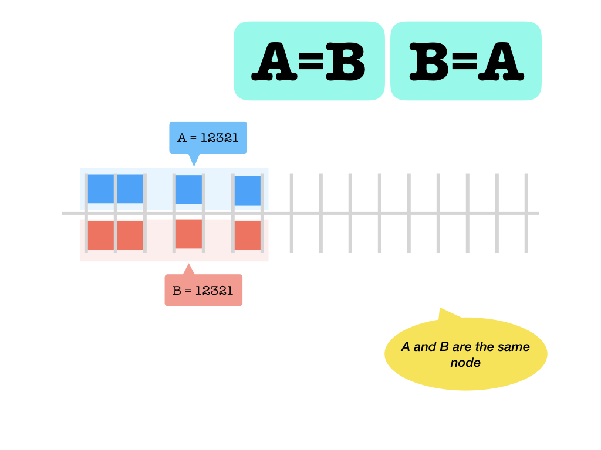
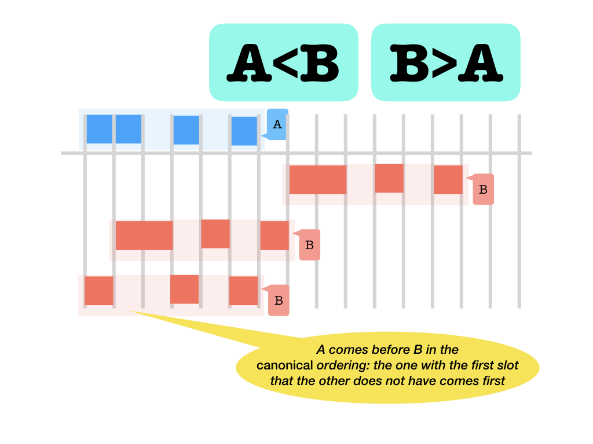
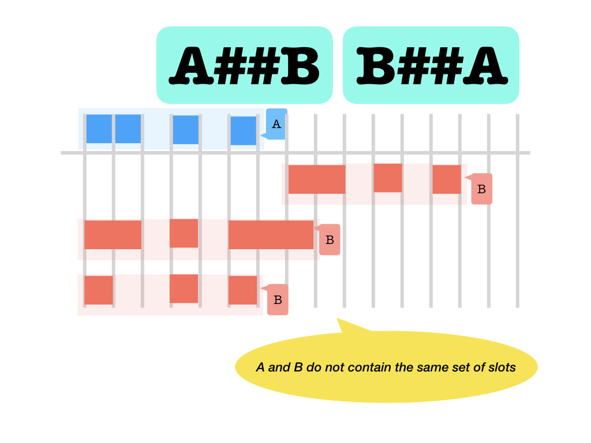
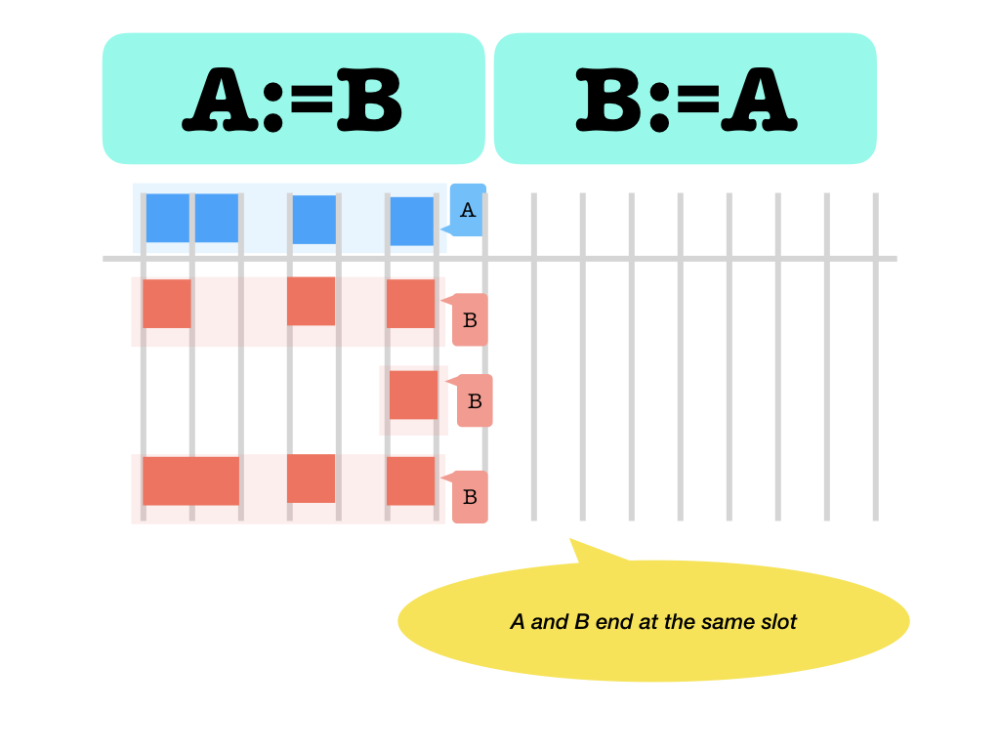
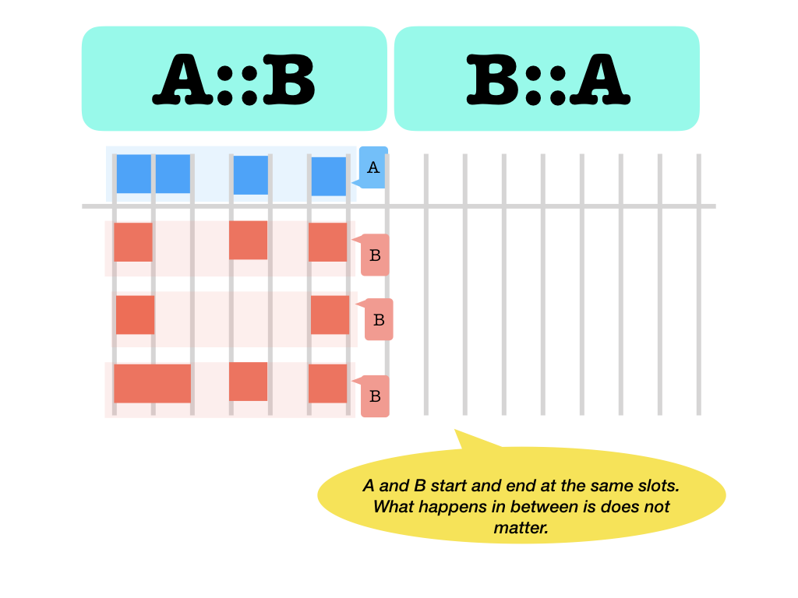
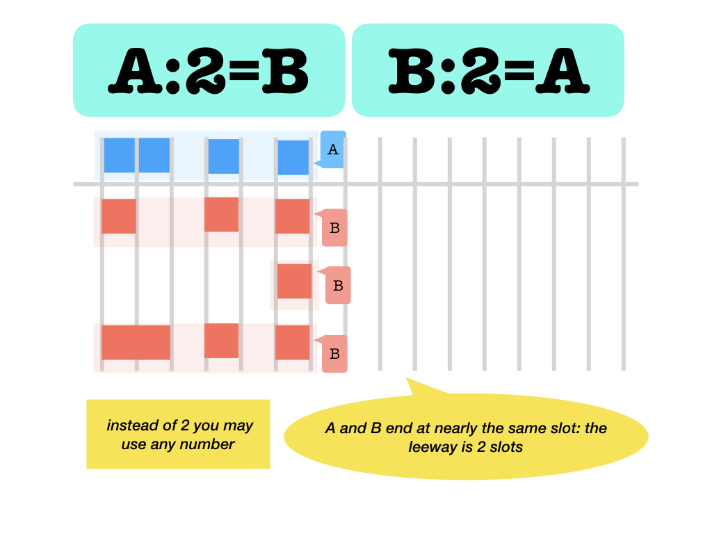
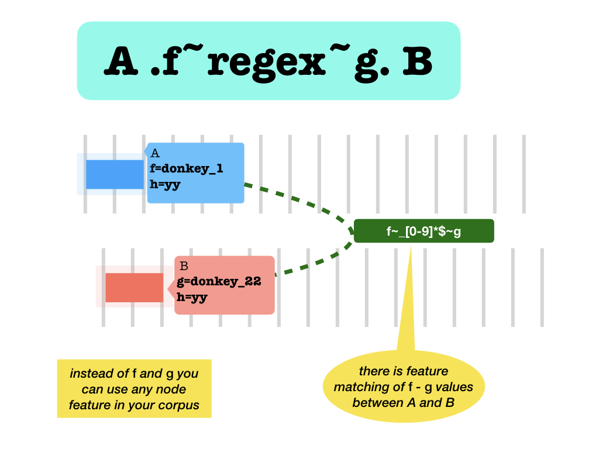
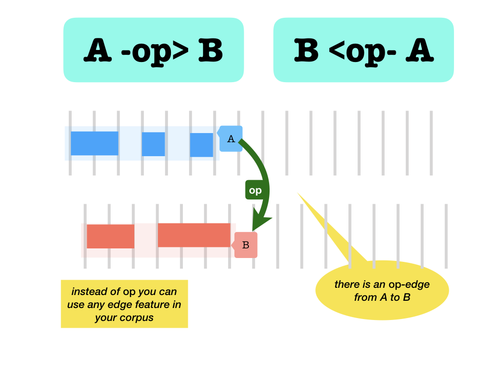

# Usage

## What is Text-Fabric Search?

You can query for graph like structures
in your data set. The structure you are interested in has to be written as a
*search template*.

A search template expresses a pattern of nodes and edges with additional conditions
also known as *quantifiers*.

You can query a TF corpus in the TF browser.

You can also run queries on arbitrary TF corpora programmatically, e.g. in a Jupyter
notebook, by using the `S` Api, documented here.

## Search primer

A search template consists of a bunch of lines,
possibly indented, that specify objects to look for. Here is a simple example:

```
book name=Genesis|Exodus
   chapter number=2
      sentence
        word pos=verb gender=feminine number=plural
        word pos=noun gender=feminine number=singular
```

This template looks for word combinations within a sentence within chapter 2 of
either Genesis or Exodus, where one of the words is a verb and the other is a
noun. Both have a feminine inflection, but the verb is plural and the noun is
singular.

The indentation signifies embedding, i.e. containment. The two words are
contained in the same sentence, the sentence is contained in the chapter, the
chapter in the book.

The conditions you specify on book, chapter, word are all conditions in terms of
[node features](#feature-specifications).
You can use all features in the corpus for this.

The order of the two words is immaterial. If there are cases where the verb
follows the noun, they will be included in the results.

Also, the words do not have to be adjacent. If there are cases with words
intervening between the noun and the verb, they will be included in the results.

Speaking of results: the `search` function returns its results as tuples of
nodes:

```python
(book, chapter, sentence, word1, word2)
```

With these nodes in hand, you can programmatically gather all information about
the results that the corpus provides.

If the order between the verb and the noun is important, you can specify that as
an additional constraint. You can give the words a name, and state a relational
condition. Here we state that the noun precedes the verb.

```
book name=Genesis|Exodus
   chapter number=2
      sentence
        vb:word pos=verb gender=feminine number=plural
        nn:word pos=noun gender=feminine number=singular
nn < vb
```

This can be written a bit more economically as:

```
book name=Genesis|Exodus
   chapter number=2
      sentence
        word pos=verb gender=feminine number=plural
        > word pos=noun gender=feminine number=singular
```

If you insist that the noun immediately precedes the verb, you can use a
different relational operator:

```
book name=Genesis|Exodus
   chapter number=2
      sentence
        word pos=verb gender=feminine number=plural
        :> word pos=noun gender=feminine number=singular
```

There are more kinds of
[relational operators](#relational-operators).

If the noun must be the first word in the sentence, you can specify it as

```
book name=Genesis|Exodus
   chapter number=2
      s:sentence
        w:word pos=noun gender=feminine number=singular
        <: word pos=verb gender=feminine number=plural
s =: w
```

or a bit more economically:

```
book name=Genesis|Exodus
   chapter number=2
      sentence
        =: word pos=noun gender=feminine number=singular
        <: word pos=verb gender=feminine number=plural
```

If the verb must be the last word in the sentence, you can specify it as

```
book name=Genesis|Exodus
   chapter number=2
      s:sentence
        word pos=noun gender=feminine number=singular
        <: w:word pos=verb gender=feminine number=plural
s := w
```

or a bit more economically:

```
book name=Genesis|Exodus
   chapter number=2
      s:sentence
        word pos=noun gender=feminine number=singular
        <: word pos=verb gender=feminine number=plural
        :=
```

You can also use the [edge features](#relational-operators) in the corpus as
relational operators as well.

Suppose we have an edge feature `sub` between clauses, such that if main clause
*m* has subordinate clauses *s1*, *s2* and *s3*, then

```
E.sub.f(m) = (s1, s2, s3)
```

You can use this relation in search. Suppose we want to find the noun verb pair
in subordinate clauses only. We can use this template:

```
book name=Genesis|Exodus
   chapter number=2
      m:clause
        s:clause
          word pos=verb gender=feminine number=plural
          :> word pos=noun gender=feminine number=singular
m -sub> s
```

or a bit more economically:

```
book name=Genesis|Exodus
  chapter number=2
    clause
      -sub> clause
        word    pos=verb gender=feminine number=plural
        :> word pos=noun gender=feminine number=singular
```

Read `m -sub> s` as: there is a `sub`-arrow from `m` to `s`.

Edge features may have values.
For example, the
[crossref feature](https://github.com/etcbc/parallels)
is a set of edges between parallel verses, with the levels of confidence
as values. This number is an integer between 0 and 100.
We can ask for parallel verses in an unqualified way:

```
verse
<crossref> verse
```

But we can also ask for the cases with a specific confidence:

```
verse
<crossref=90> verse
```

or cases with a high confidence:

```
verse
<crossref>95> verse
```

or cases with a low confidence:

```
verse
<crossref<80> verse
```

All feature conditions that you can assert on node features, you can also
assert for edge features. If an edge feature is integer valued, such as `crossref`
you can use comparisons; if it is string valued, you can use regular expressions.
In both cases you can also use the other constructs, such as

```
verse
<crossref=66|77> verse
```

To get a more specific introduction to search, consult the search tutorials for
app supported [annotated corpora](https://github.com/annotation).

Finally an example with quantifiers. We want all clauses where Pred-phrases
consist of verbs only:

```
  clause
  /where/
    phrase function=Pred
  /have/
    /without/
      word sp#verb
    /-/
  /-/
```

## Search template reference

### Template lines

We have these kinds of lines in a template:

*   *comment* lines

    *   if the first non-white character on a line is `%` it is a comment line;
    *   you cannot comment out parts of lines after a non-white part;
    *   if a line is empty or has whitespace only, it is a comment line;
    *   comment lines are allowed everywhere;
    *   comment lines are ignored.

*   *atom* lines

    *   (simple): **indent name:otype-or-set features**

        *   Examples

            1.  `word pos=verb gender=feminine`
            2.  `vb:word pos=verb gender=feminine`
            3.  `vb pos=verb gender=feminine`

        *   The indent is significant. Indent is counted as the number of white space
            characters, where tabs count for just 1. **Avoid tabs!**.
        *   The **name:** part is optional.
            If present, it defines a name for this atom that can be used
            in relational comparisons and other atoms.
        *   The **otype-or-set** part is optional.
            If it is absent, the **name** part must be present.
            The meaning of

            ```
            p:phrase sp=verb
            p vs=qal
            ```

            is identical to the meaning of

            ```
            p:phrase sp=verb
            pnew:phrase vs=qal
            p = pnew
            ```

    *   (with relop): **indent op name:otype-or-set features**

        *   `<: word pos=verb gender=feminine`
        *   The relation operator specifies an extra constraint between a preceding atom
            and this atom.
        *   The preceding atom may be the parent, provided we are at its first child, or
            it may the preceding sibling.
        *   You can leave out the **name:otype-or-set features** bit. In that case, the
            relation holds between the preceding atom and its parent.
        *   The **name:** part is optional. Exactly as in the case without relop.
        *   The **otype-or-set** part is optional. Exactly as in the case without relop.

    The otype-or-set is either a node type that exists in your TF data set,
    or it is the name of a set that you have passed in the `sets` parameter alongside
    the query itself when you call `search` or `study`.

    See [*feature specifications*](#feature-specifications) below for all
    full variety of feature constraints on nodes and edges.

*   *feature* lines: **features**

    *   Indent is not significant. Continuation of feature constraints after a
        preceding atom line or other feature line. This way you can divide lengthy
        feature constraints over multiple lines.

    See
    [*feature specifications*](#feature-specifications)
    below for the
    full variety of feature constraints on nodes and edges.

*   *relation* lines: **name operator name**

    *   `s := w`
    *   `m -sub> s`
    *   `m <sub- s`
    *   `m <sub> s`
    *   Indents and spacing are ignored.
    *   There must be white-space around the operator.
    *   Operators that come from edge features may be enriched with values.

    See
    [*relational operators*](#relational-operators)
    below for the
    whole spectrum of relational constraints on nodes.


*   *quantifier* sub-templates:
    Atom lines that contain an otype or set may be followed by
    Quantifiers consist of search templates themselves, demarcated by some
    special keywords:

    *   `/without/`
    *   `/where/` and `/have/`
    *   `/with/` and `/or/`
    *   `/-/`

    See [*quantifiers*](#quantifiers) below for all the syntax and semantics.

### Feature specifications

The **features** above is a specification of what features with
which values to search for. This specification must be written as a white-space
separated list of **feature specs**.

A **feature spec** has the form *name* *valueSpec*, with no space between the *name*
and the *valueSpec*.

#### Value specifications

The *valueSpec* may have the following forms and
meanings:

form | evaluates to `True` the feature *name* ...
---- | -------
| has any value except `None`
`#` | has value `None`
`*` | has arbitrary value
`=`*values* | has one of the values specified
`#`*values* | has none of the values specified
`>`*value* | is greater than *value*
`<`*value* | is less than *value*
`~`*regular expression* | has a value and it matches *regular expression*

!!! hint "Why `*` ?"
    The operator `*` after a feature name does not pose any restriction at all.
    It will not influence the search results.

    *Why would you want to include such a "criterion"?*

    Some applications, such as the Text-Fabric browser collect the features used in a query
    to retrieve result information to be presented to the user. So if you want to include
    the values of a particular feature, mention that feature with a `*`.

All these forms are also valid as
`-`*name* *form*`>` and `<`*name* *form*`-` and `<`*name* *form*`>`,
in which case
they specify value constraints on edge features.
This is only meaningful if the edge feature is declared to have values (most edge features
do not have values).

#### Additional constraints

*   There may be no space around the `=#<>~`. 
*   *name* must be a feature name that exists in the dataset. If it references a
    feature that is not yet loaded, the feature will be loaded automatically.
*   *values* must be a `|` separated list of feature values, no quotes. No spaces
    around the `|`. If you need a space or `|` or `\` in a value, escape it by a
    `\`. Escape tabs and newlines as `\t` and `\n`.
*   When comparing values with `<` and `>`:
    *   *value* must be an integer (negative values allowed);
    *   You can do numeric comparisons only on number-valued features,
        not on string-valued features.
    *   If the feature in question is not defined for a node, or has the value `None`
        the outcome is always `False`.
*   *regular expression* must be a string that conforms to the Python
    [regular axpression syntax](https://docs.python.org/3/library/re.html#regular-expression-syntax)
    *   If you need a space in your regular expression, you have to escape it with a
        `\`.
    *   You can do regular expressions only on string-valued features, not on
        number-valued features.

### Relational operators

#### Node comparison

*   `=`: is equal (meaning the same node, a clause and a verse that occupy the
    same slots are still unequal)
    
*   `#`: is unequal (meaning a different node, a clause and a verse that occupy
    the same slots are still unequal)
    
*   `<` `>`: before and after (in the *canonical ordering*)
    

#### Slot comparison

*   `==`: occupy the same slots (identical slot sets)
    
*   `&&`: overlap (the intersection of both slot sets is not empty)
    
*   `##`: occupy different slots (but they may overlap, the set of slots of the
    two are different as sets)
    
*   `||`: occupy disjoint slots (no slot occupied by the one is also occupied by
    the other)
    
*   `[[ ]]`: embeds and contains (slot set inclusion, in both directions)
    
    Never holds between the same nodes. But it holds between different nodes
    with the same slots. But a slot can never embed an other node.
*   `<<` `>>`: before and after (with respect to the slots occupied: left ends
    before right starts and vice versa)
    
*   `<:` `:>`: *adjacent* before and after (with respect to the slots occupied:
    left ends immediately before right starts and vice versa)
    
*   `=:` left and right start at the same slot
    
*   `:=` left and right end at the same slot
    
*   `::` left and right start and end at the same slot
    

#### Nearness comparison

Some of the adjacency relations can actually be weakened. Instead of requiring
that one slot is equal to an other slot, you can require that they are *k-near*,
i.e. they are at most *k* apart. Here are the relationships where you can do
that. Instead of typing the letter `k`, provide the actual number you want.

*   `<k:` `:k>`: `k`-*adjacent* before and after (with respect to the slots
    occupied: left ends `k`-near where right starts and vice versa)
    
*   `=k:` left and right start at `k`-near slots
    
*   `:k=` left and right end at `k`-near slots
    
*   `:k:` left and right start and end at `k`-near slots
    

#### Based on node features

Nodes can be compared on the basis of the features that they have.
For each pair of node features *f*, *g* there is a relation between nodes
that holds precisely when feature *f* of the first node has the same value as
feature *g* on the second node. This can be used in search templates.
Not only equality is covered, also inequality, comparison, and matching.

*   `.f.` and `.f=g.` feature equality:
    the `f` value of the left node is equal to the `g` value of the right node.

    `.f.` is an abbreviation for `.f=f.`.
    
    
    !!! caution "None values"
        If one or both of the nodes does not have a value, the result is `False`.

        In particular, two nodes that have both `None` for a feature `f`, count as
        having unequal values for `f`.
*   `.f#g.` feature inequality:
    the `f` value of the left node is unequal to the `g` value of the right node.
    
    
    !!! caution "None values"
        If one or both of the nodes does not have a value, the result is `True`.

        In particular, two nodes that have both `None` for a feature `f`, count as
        having unequal values for `f`.
*   `.f<g.` and `.f>g.` feature less than and greater than:
    the `f` value of the left node is less/greater than the `g` value of right node.
    This is only legal if both `f` and `g` are integer valued features.
    
    
    !!! caution "None values"
        If one or both of the nodes does not have a value, the result is `False`.
*   `.f~regex~g.` Features match:
    they are equal modulo the replacement of the parts that match the `regex`.
    This is only legal if both `f` and `g` are string valued features.
    
    
    !!! example
        If node `n` has feature `lex` with value `donkey_1`
        and node `m` has feature `lex` with value `donkey_2`,
        then the following holds:

        ```
        n .lex~_[0-9]*$~lex. m
        ```

        The values are stripped of their final `_1` and `_2` strings before they
        are being compared, leaving the comparison `donkey` = `donkey`, which is True.

    !!! caution "None values"
        If one or both of the nodes does not have a value, the result is `False`.

#### Based on edge features

Edge features are based on directed edges.
An edge from `n` to `m` is not the same as an edge from `m` to `n`.
For each direction there is a relation operator.
And there is an operator corresponding to the *symmetric closure*
of the edges.

*   without values

    *   A `-`*name*`>` B: edge from A to B
    *   A `<`*name*`-` B: edge from B to A
    *   A `<`*name*`>` B: edge from A to B or from B to A or both

    These forms work for edges that do and do not have values;

    

    

*   with values

    *   A `-`*name* *valueSpec*`>` B: edge with value from A to B
    *   A `<`*name* *valueSpec*`-` B: edge with value from B to A
    *   A `<`*name* *valueSpec*`>` B: edge with value from A to B
        or form B to A or both

    These forms work only for edges that do have values.

    

    

### Quantifiers

Quantifiers are powerful expressions in templates.

They state conditions on a given atom in your template.
The atom in question is called the *parent* atom.
The conditions may involve *many* nodes that are related to the parent,
as in:

*all embedded words are a verb*;

*without a following predicate phrase*;

*with a mother clause or a mother phrase*.

That is where the term *quantifier* comes from.

A quantifier *quantifies* its parent atom.

#### /without/

Syntax:

```
atom
/without/
templateN
/-/
```

Meaning:

node *r* is a result of this template if and only if *r* is a result of `atom` and
there is no tuple *RN* such that (*r*, *RN*) is a result of

```
atom
templateN
```

#### /where/

Syntax:

```
atom
/where/
templateA
/have/
templateH
/-/
```

Meaning:

node *r* is a result of this template if and only if *r* is a result of `atom` and
for all tuples (*RA*) such that (*r*, *RA*) is a result of

```
atom
templateA
```

there is a tuple *RH* such that (*r*, *RA*, *RH*)  is a result of

```
atom
templateA
templateH
```

#### /with/

Syntax:

```
atom
/with/
templateO1
/or/
templateO2
/or/
templateO3
/-/
```

Meaning:

node *r* is a result of this template if and only if:
there is a tuple *R1* such that (*r*, *R1*) is a result of

```
atom
templateO1
```

or there is a tuple *R2* such that (*r*, *R2*) is a result of

```
atom
templateO2
```

or there is a tuple *R3* such that (*r*, *R3*) is a result of

```
atom
templateO3
```

##### 1 or more alternatives

This quantifier can be used with any number of `/or/` keywords, including
none at all. If there is no `/or/`, there is just one alternative.
The only difference between

```
atom
/with/
template
/-/
```

and

```
atom
template
```

is that the results of the first query contain tuples with only one
element, corresponding to the `atom`.
The second query contains tuples of which the first element
corresponds to the `atom`, and the remaining members correspond to
the `template`.

##### Parent

The `atom` bit is an atom line, it acts as the *parent* of the
quantifier. Inside a quantifier, you may refer to the parent by the special name
`..`. So you do not have to give a name to the parent.

##### Multiple quantifiers

You may have multiple quantifiers for one parent.

##### Not in result tuples

Whereas a the search for a normal template proceeds by finding a tuple
that instantiates all its nodes in such a way that
all relationships expressed in the template hold, a quantifier template is not
instantiated. It asserts a condition that has to be tested for all nodes
relative its parent. None of the atoms in a template of a quantifier corresponds
to a node in a final result tuple.

##### May be nested

Templates within a quantifier may contain other
quantifiers. The idea is, that whenever a search template is evaluated,
quantifiers at the outer level of get interpreted. This interpretation gives
rise to one or more templates to be constructed and run. Those new templates
have been stripped of the outer layer of quantifiers, and when these templates
are executed, the quantifiers at the next level have become outer. And so on.

##### Restrictions

Due to the implementation of quantifiers there are certain restrictions.

*   Quantifiers must be put immediately below their parents or below
    preceding quantifiers of the same parent.
*   The keywords of a quantifier must appear on lines with exactly the same indentation
    as the atom they quantify.
*   The templates of a quantifier must have equal or greater indent than its keywords;
*   The names accessible to the templates inside a quantifier are:

    *   the name `..`, which is the name of the atom that is quantified;
        this name is automagically valid in quantifier templates;
    *   the name of the atom that is quantified (if that atom has a given name);
    *   names defined in the template itself;
    *   in `/where/`, `templateH` may use names defined in `templateA`;
        but only if these names are defined outside any quantifier of
        `templateA`.

*   The following situations block the visibility of names:

    *   in `/with/`, `templateO`*i* may not use names defined in `templateO`*j* for *j* other than *i*;
    *   names defined outer quantifiers are not accessible in inner quantifiers;
    *   names defined inner quantifiers are not accessible in outer quantifiers.

When you nest quantifiers, think of the way they will be recomposed into
ordinary templates. This dictates whether your quantifier is syntactically valid or not.

##### Indentation

The indentation in quantifiers relative to their parent atom will be preserved.  

!!! example "Nested quantifiers"
    Consider

    ```
    clause
    /where/
      phrase function=Pred
    /have/
      /without/
        word sp#verb
      /-/
    /-/
      phrase function=Subj
    ```

    The auxiliary templates that will be run are:

    For the outer quantifier:

    ```
    clause
      phrase function=Pred
    ```

    and

    ```
    clause
      phrase function=Pred
      /without/
        word sp#verb
      /-/
    ```

    For the inner quantifier:

    ```
    phrase function=Pred
      word sp#verb
    ```

    Note that the auxiliary template for the inner quantifier
    is shifted in its entirety to the left, but that the
    relative indentation is exactly as it shows in the original template.

##### Implementation

Here is a description of the implementation of the
quantifiers. It is not the real implementation, but it makes clear what is going
on, and why the quantifiers have certain limitations, and how indentation works.

The basic idea is:

*   a quantifier leads to the execution of one or more separate searche templates;
*   the results of these searches are combined by means of set operations:
    *difference*, *intersection*, *union*, dependent on the nature of the quantifier;
*   the end result of this combination will fed as a custom set to
    the original template after
    stripping the whole quantifier from that template.
    So we replace a quantifier by a custom set.

Suppose we have

```
clause typ=Wx0
QUANTIFIER1
QUANTIFIER2
...
QUANTIFIERn
  rest-of-template
```

We compute a set of clauses `filteredClauses1` based on

```
clause typ=Wx0
QUANTIFIER1
```

and then compute a new set `filteredClauses2` based on

```
S.search('''
fclause typ=Wx0
QUANTIFIER2
''',
    customSets=dict(fclause=filteredClauses1)
```

and so on until we have had QUANTIFIERn,
leading to a set `filteredClausesN` of clauses
that pass all filters set by the quantifiers.

Finally, we deliver the results of

```
S.search('''
fclause
  rest-of-template
''',
    customSets=dict(fclause=filteredClausesN)
```
