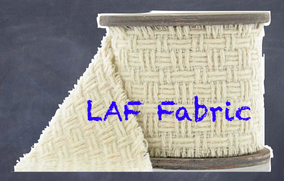

LAF-Fabric |version|
====================

(for provenance of this image, see [#laffabric]_)

Contents:

.. toctree::
    :maxdepth: 2

    texts/welcome
    texts/release-notes
    texts/about-laf-fabric
    texts/getting-started
    texts/background
    texts/API-reference
    texts/ETCBC-reference
    texts/EMDROS2LAF-reference
    laf/modules.rst
    etcbc/modules.rst
    emdros2laf/modules.rst

Indices and tables
==================

* :ref:`genindex`
* :ref:`modindex`
* :ref:`search`

.. rubric:: Footnotes

.. [#laffabric] Image found by an internet search on fabric and some other term that I forgot.
   By a google search on the image itself, I managed to find the
   original context at ``http://www.hobbycraft.co.uk/hobbycraft-textured-fabric-reel-cream-2-metre/584337-1000``.

   Today, 2014-01-16, that link is not accessible anymore.
   A google search on the image itself yields no hits except the present page and some related pages.

   So, LAF-Fabric has given this image a second life!
