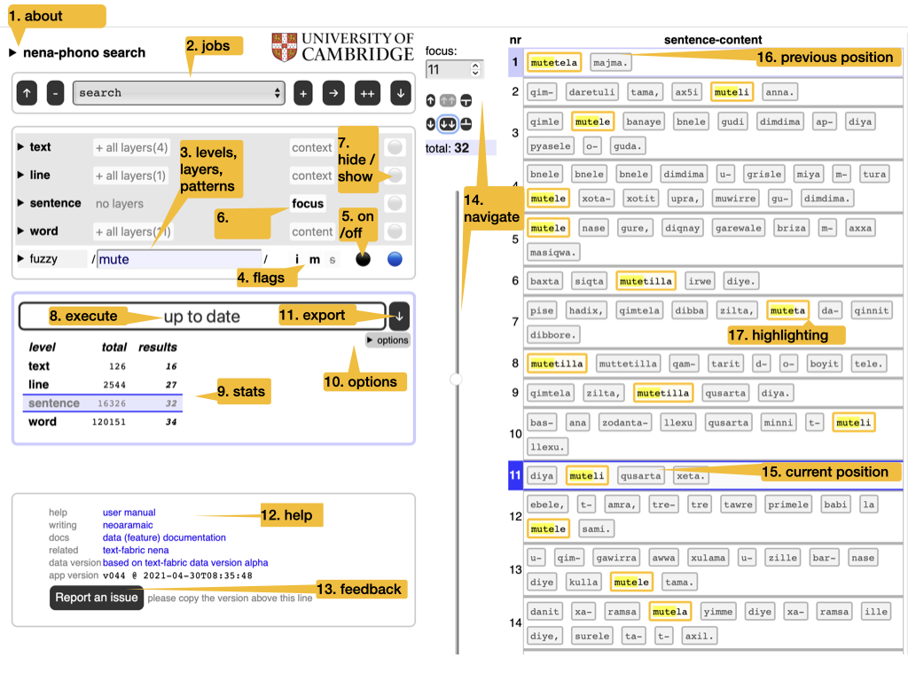
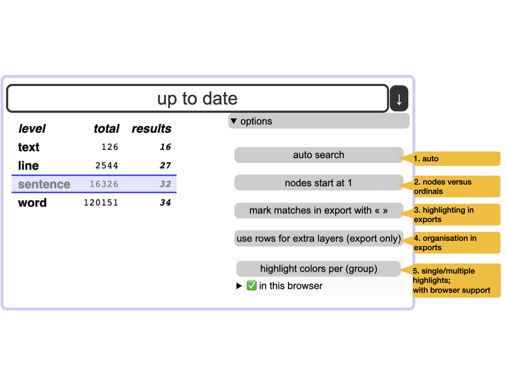
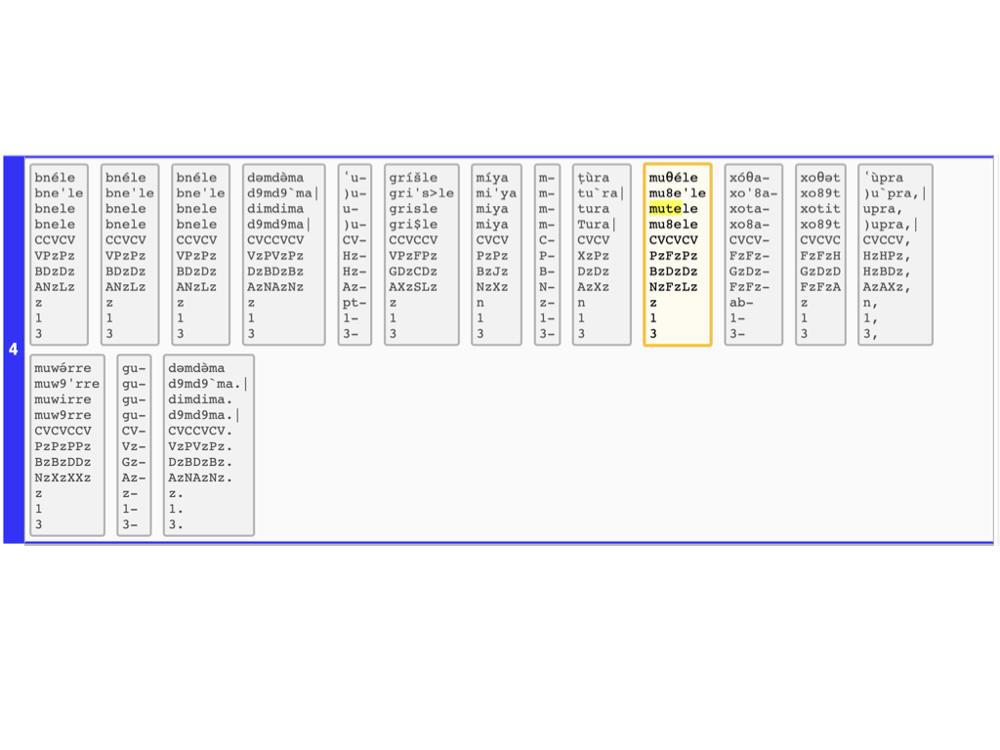

# Quick start




<mark>1. about</mark>
:   Read the colofon, with provenance and license information.

<mark>2. jobs</mark>
:   Manage your search tasks. They are remembered by your browser. You can start new jobs,
    rename, duplicate and delete them. You can import jobs from file and export them to file.

    !!! hint
        Use this when switching between browsers. That includes sharing jobs with other people.

<mark>3. levels, layers, regexes</mark>
:   The corpus is represented in multiple ways: the *layers*.
    They have been generated by choosing a *level* (such as text, line, word),
    and representing the objects of that level by some of their *features*
    (such as title, number, transcription).
    Each layer can be searched by means of a search pattern.
    Such patterns are technically *regular expressions*; 
    from now on we use the term **regex**, plural **regexes**.

    !!! hint
        Read
        [background on regexes](https://en.wikipedia.org/wiki/Regular_expression)
        and
        [cheatsheet](https://developer.mozilla.org/en-US/docs/Web/JavaScript/Guide/Regular_Expressions/Cheatsheet).

<mark>4. flags</mark>
:   When searching with regexes, you can alter their interpretation by setting some *flags*:

    *    `i`: case-insensitive;
    *    `m`: multiline: `^` and `$` match around embedded newlines;
    *    `s`: single-string: `.` also matches newlines.

<mark>5. on/off</mark>
:   Regexes can be switched off and on.

    !!! hint
        Use this to explore the effect of individual regexes.

<mark>6. focus</mark>
:   The level that corresponds with a single row in the results table.
    Think of result rows as *observations* with *features*.

<mark>7. hide/show</mark>
:   Whether a layer/level should show up in the results.
    Showing a level means showing their objects by their identifying numbers.
    See option **nodes and ordinals** below.

    !!! hint
        You can show layers in which you do not search,
        and hide layers in which you do search.

<mark>8. execute</mark>
:   Press this to execute the current search job.

    !!! hint
        There is an option to do this automatically
        whenever you have changed something in the search criteria.

<mark>9. stats</mark>
:   Statistics of the current search results,
    compared to the statistics of the whole corpus.

<mark>10. options</mark>
:   Modify the behaviour of search/export.
    See **Options** below.

<mark>11. export</mark>
:   Export the search results as a tab-separated file (`.tsv`).
    This file can be opened in Excel.
    All  results are exported, not only the ones that show on the current page.
    The level of detail depends on the currently selected **focus** level
    and the visible layers as set by **hide/show**.

    !!! hint
        The precise organization of the export may depend on some of the options.
        See **Export** below.

<mark>12. help</mark>
:   Various links to information that you frequently need:
    this help, the data features of the corpus, related corpus data.

<mark>13. feedback</mark>
:   File an issue on GitHub;
    please copy and paste the version of this app in any issue you file.

<mark>14. navigate</mark>
:   Walk through the results in various ways:

    *   manual entry of the position number,
    *   small jumps back and forth,
    *   big strides with the slider.

    !!! hint
        Use keyboard shortcuts, all shortcuts need to be pressed with modifier keys:

        browser | Windows | - | Linux | - | Mac
        --- | --- | --- | --- | --- | ---
        Firefox | <kbd>Alt</kbd> + <kbd>Shift</kbd> | | <kbd>Alt</kbd> + <kbd>Shift</kbd> | | <kbd>Ctrl</kbd> + <kbd>Option</kbd> 
        Chrome | <kbd>Alt</kbd> + <kbd>Shift</kbd> | | <kbd>Alt</kbd> | | <kbd>Ctrl</kbd> + <kbd>Option</kbd> 
        Edge | <kbd>Alt</kbd> + <kbd>Shift</kbd> | | | | <kbd>Ctrl</kbd> + <kbd>Option</kbd> 
        Safari | | | | | <kbd>Ctrl</kbd> + <kbd>Option</kbd> 

        shortcut | direction | amount
        --- | --- | ---
        `m` | NA | manual entry of the result number
        `n` | **n**ext | one
        `p` | **p**revious | one
        `b` | **b**ack | a batch (half a screenful)
        `f` | **f**orward | a batch (half a screen)
        `s` | **s**tart | all the way
        `e` | **e**end | all the way
    
<mark>15. position</mark>
:   The current position in the results table is marked.

<mark>16. previous position</mark>
:   The previous position in the results table is also marked,
    in a slightly less conspicuous way.

<mark>17. highlighting</mark>
:   The portions in the layer that match the corresponding regex are highlighted.

    !!! hint
        Highlights are exported by enclosing the text in « and »,
        but you can switch this off by means of an option.
        See **Options** below.
    
## Export

You can export the search results to Excel (or rather, a tab-separated file, `.tsv`).
When you do that, *all* results will get exported, not only the ones that show
on the interface.

The organization of the exported results reflects the interface.
It makes sense to think of the rows as observations, and the columns as properties of those observations.

We may have issued multiple regexes to multiple layers, so we have to define our concept of observation.

The first ingredient is our **focus** level: the objects in this level are the units of observation.
For each focus object there is a row in the result table.

The focus objects have *context* and *content*.

The *context* consists of the objects that enclose the focus object.
For each level of context objects there will be a column in the result row.

The *content* consists of the objects contained in the focus objects.
We have a single column for the content of the focus objects.

!!! example
    If the focus level is *sentence* then the focus objects are sentences.

    The context of a *sentence* consists of the *lines* and *texts* that contain that sentence.
    In this corpus each sentence has exactly 1 *line* and exactly 1 *text* in which it is contained.
    In other corpora that might be different: it could be more or less.

    The content of a sentence consists of all of its *word* objects, concatenated.

    If the focus level is *line*, then the focus objects are lines.

    The context of a *line* consists of exactly 1 *text* that contains the line.

    The content of a line consists of all of its *sentence* and *word* objects,
    properly nested and concatenated.

!!! caution "An object is distinct from its content"
    When we represent an object, we use the layers of the level of that object.

    Take a *text* for example.
    There are a few layers for a text, such as dialect, place, title.
    Hence a text is represented by just its title, or its place, or its dialect,
    depending on which layer you use for the representation.

    The *content* of a text is a much bigger thing.
    It is the collection of all its line, sentence, and word objects
    represented in their own layers.

    When we represent only the object, we call it a *shallow* representation.
    When we represent the *content* of an object, we call it a *deep* representation.

    An observation is represented by:

    * shallow representations of the context objects,
    * a shallow representation of the focus object,
    * a deep representation of the focus object.

All objects are represented ultimately by their material in the layers.
When we display results or export them,
we present all layers that you have selected by means of **hide/show**.

!!! note "Multiple layers"
    If multiple layers have been selected for some levels,
    we show them all on the interface in a graceful way.
    However, the format of a table is much more restricted,
    and we have to make a tough choice here:
    we can use extra columns or extra rows for multiple layers.
    Both have advantages and disadvantages.

    **layers to columns**:

    *   `+`: one result, one row, good for postprocessing
    *   `-`: the layers  of one object do not line up, difficult visual inspection

    **layers to rows**:

    *   `-`: one result, multiple rows, complicates postprocessing
    *   `+`: the layers  of one object line up, comfortable visual inspection

    Observe the difference:


## Options



<mark>1. auto</mark>
:   Executes the search automatically whenever you have changed some criterion.
    Also updates the results when you have modified the focus and visibility of layers.

<mark>2. nodes versus ordinals</mark>
:   Each object in the corpus has a unique number: its *node* number.
    Within a level, we can also enumerate all its objects, starting with 1.
    The ordinals identify objects uniquely within their level.
    You can choose wich of these numbers you want displayed.

    !!! hint
        Use nodes for interoperability with Text-Fabric;
        otherwise ordinals are more intuitive.

<mark>3. highlighting in exports</mark>
:   Highlighted matches are a valuable outcome of a search.
    But in exports, the highlight characters « » may hinder further processing.
    So you can omit them.

<mark>4. organisation of exports</mark>
:   When several layers are visible for a level, the question arises:
    how should we organize them in exported results?
    There are two options:

    *   use extra rows for the extra layers;
    *   use extra columns for the extra layers.

    You choose!
    The difference is shown in section **Exports** above.

    !!! hint
        Use extra rows if you rely on visual inspection of the exported file in Excel.
        Use extra columns if you want to process the exported file by means of other tools,
        such as Pandas or R.

<mark>5. single or multiple highlights</mark>
:   If you use `( )` for grouping in your regexes,
    the parts of the results that match these groups
    can be highlighted with different colours.
    
    !!! hint
        Not all browsers support this;
        the interface shows whether your browser supports it,
        and which other browsers support it.

    !!! hint
        This is handy for cases where you search for twice the same thing in a sentence,
        for instance.
        You can have both matches coloured differently.
    

# Background information

Layered-search is a way of full-text searching your corpus by means of
[regular expressions](https://developer.mozilla.org/en-US/docs/Web/JavaScript/Guide/Regular_Expressions/Cheatsheet).
but with a twist:
you can search in several layers of the corpus by means of several regexes in parallel.
It is a method to make good use of the annotations that exist in the corpus at various levels.

Regular expressions are a key tool for specifying sophisticated search patterns.
Their theoretical foundation was layed in the 1950s,
and by now they have been implemented in all major
programming languages and in all powerful text-editors.

If this is the first time you encounter them, it will pay off to get to know them well,
because it is very likely that you encounter them again.

For more background,
read [wikipedia](https://en.wikipedia.org/wiki/Regular_expression).

## Corpus in layers

Your corpus is divided into levels, e.g. book/chapter/verse/sentence/word/line/letter.

At each level there are objects in the corpus and they can be represented in certain ways:

* books are represented by book titles;
* chapters and verses are represented by their numbers;
* words and letters are represented by the strings of which they are composed.

Per level, there may be more than one way to represent the objects.
For example, at the word level, you may have representations in the original script in unicode,
but also various transliterations in ascii.

All these representations are *layers* that you can search.
For example, the
[NENA corpus](https://github.com/CambridgeSemiticsLab/nena_tf)
contains various text representations,
among which several are dedicated to phonetic properties.



Layers do not have to correspond with the text of the corpus.
They can be based of arbitrary annotations that exist in the corpus.
For example, you can make a layer where you put the part-of-speech of the
words after each other. You could then search for things like

```
(verb noun noun)+
```

We'll stick to NENA for examples of layered search.

## Combined search

In order to search, you specify search patterns for as many of
the available layers as you want.

When the search is performed, all these layers will produce results,
and the results per layer will be compared, and only results that
hold in all layers, are retained, partial results are discarded.

So, if you have specified 

level | layer | pattern
--- | --- | ---
**word** | **fuzzy** | `m[a-z]*t[a-z]*l`

you get all words with an `m`, `t`, and `l` in it, in that order.
There are 1338 such words in 1238 sentences.

By showing the **full** layer,
you will see the full-ascii transliteration of these results as well.

You can specify an additional search in the **full** layer, for example
all words with a backquote \` in it. (A combining vowel diacritic).

level | layer | pattern
--- | --- | ---
**word** | **full** | \`
**word** | **fuzzy** | `m[a-z]*t[a-z]*l`

We then get the words that meet both criteria, still a good 492.

You can also constrain with other levels.
Suppose we want only occurrences of the previous results in texts
written at the place *Dure*.

level | layer | pattern
--- | --- | ---
**text** | **place** | `Dure`
**word** | **full** | \`
**word** | **fuzzy** | `m[a-z]*t[a-z]*l`

You can go even further:
we want the results to be in the first 3 lines of the texts:

level | layer | pattern
--- | --- | ---
**text** | **place** | `Dure`
**line** | **number** | `\b[1-3]\b`
**word** | **full** | \`
**word** | **fuzzy** | `m[a-z]*t[a-z]*l`

We are left with 20 results.

# The search interface as app

We have implemented layered search as an offline Single Page Application.

The app consists of a single HTML file (*app*`.html`),
a CSS file, PNG files (logos) and Javascript files.
The corpus data is in a big Javascript file, the corpus configuration in a small one.
The remaining Javascript files are the modules of the program.

Modern browsers can take in modular Javascript, except when you have the HTML file
locally on your computer and you open it with a double click.
Your browser has then `file://` in its URL bar, and in that cases modular Javascript does
not work.

To overcome that, we have also bundled the program in a single file, and that is included by
*app*-`local.html`.

From within the app, you can download a zip file with *app*`-local.html` in it,
so that you can have the full search experience completely off-line.

Also when you have opened this page over the internet, your browser has downloaded the
complete app, and all interaction between you and the search app happens at your browser,
without further internet connection (except when you navigate to links to the internet).

As a consequence

* this app works without any kind of installation
* it does not collect data about you
* it does not use cookies.
* it works without internet connection

When the browser remembers your previous jobs,
it does not use cookies for it but
[localStorage](https://developer.mozilla.org/en-US/docs/Web/API/Window/localStorage),
which other sites cannot read.

# Making this app

The construction of this app relies very much of the organization of the corpus
as a Text-Fabric dataset.

The process of creating a layered search functionality
is currently being baked into Text-Fabric.

The designer needs to specify the layers in a `.yaml` file
and write a small piece of code to generate the data for the layers
from the corresponding Text-Fabric dataset.

See e.g.
[app-nena/layeredsearch](https://github.com/annotation/app-nena/tree/master/layeredsearch).

All the rest (building, shipping, and deploying the app) is then automatic,
See `tf.client.make.build`.

The first layered search interface created this way is one for the
[NENA](https://github.com/CambridgeSemiticsLab/nena_tf) corpus.

We intend to make more interfaces for other Text-Fabric corpora,
reducing and streamlining the preparation effort in the process.

# Credits

The idea for this app came out of a discussion of
[Cody Kingham](https://www.linkedin.com/in/cody-kingham-1135018a)
and me about how we could make a simple but usable search interface
for people that need to get hands on with a Text-Fabric corpus.

Given that we have the corpus data at our finger tips through Text-Fabric,
but that TF-Query (`tf.about.searchusage`) does not cover over all use cases,
and requires installing Python,
we adopted the approach to assemble data
and power a simple Javascript program with it.

The first implementation of these idea was funded by
[Prof. Geoffrey Khan](https://www.ames.cam.ac.uk/people/professor-geoffrey-khan)
reviewed by Cody Kingham and the people of
[Cambridge Semitics Lab](https://github.com/CambridgeSemiticsLab/nena_corpus)
and eventually written by
[Dirk Roorda](https://pure.knaw.nl/portal/en/persons/dirk-roorda).
