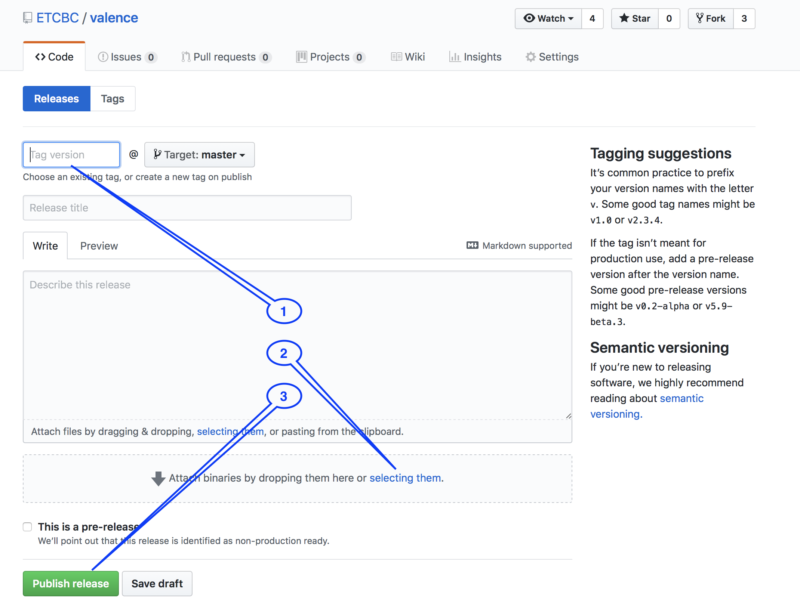

# Data sharing express guide

Text-Fabric is an analytical tool to process corpus data.
But it can also help you to transform the insights gained into new data:
new features, that you can save in TF format and share with others.

Text-Fabric supports the flow of creating research data,
packaging it, distributing it, and importing in apps.

## Zipping your new data

There is a command

```sh
text-fabric-zip
```

to make a distribution of your own features.

For an example of all the steps of data sharing, see the
[share](https://nbviewer.jupyter.org/github/annotation/tutorials/blob/master/bhsa/share.ipynb)
tutorial.

## Using new data

The `text-fabric` command has several optional command line arguments: 

    --mod=...

By means of these arguments you can load extra features, either from your own
system, or from GitHub:

```sh
text-fabric bhsa --mod=etcbc/valence/tf
```

See the incantation in `tf.app.use`.

## Using old data and apps

It is even possible to go back to earlier versions of the data and apps,
which might be needed if you want to reproduce results obtained with
those versions.

For app and data, you can add specifiers to point to a specific
release or commit.

Read more about your data life-cycle under [use data](#use-data).

## Custom sets

You can create custom sets of nodes, give them a name, and use those names
in search templates. 
The TF browser can import those sets, so that you can use such queries in the browser too.

```sh
text-fabric appname --sets=filePath
```

Read more in `tf.about.browser`.

# Data sharing in depth

## Assumptions

The data sharing workflow is built around the following assumptions:

main corpus
:   You work with a main corpus
    (it is not necessary anymore that a TF-app exists for the main corpus).
    The TF features of the corpus must be versioned, i.e. they must sit
    in a subdirectory named after the version.

versioned tf data
:   The data you share consists of a set of TF features, tied to a specific
    *version* of the main corpus, preferably the most recent version.
    The new features must sit in a directory named after the version
    of the main corpus they correspond to.

local github
:   The data you share must reside in a directory on your hard drive.
    The convention is, that you have a directory `github` under your
    home directory. And inside `github`, you have directories for
    organizations or people first, and then repositories, exactly as 
    the online GitHub is organized. 

    Your own data should be in such a repo as well, e.g.

    `ch-jensen/participants/actor/tf

    or

    `etcbc/lingo/heads/tf`

    or

    `annotation/banks/sim/tf`

synchronized with GitHub
:   You must have your local repo contents synchronized with that on GitHub.

    Now other people can use your data.
    Whenever you push updates, users may fetch the updated data, depending
    on how they call up your data, see below.

released on GitHub
:   If your data is reasonably stable, consider making an official *release*
    on GitHub.
    Then you must attach your features as a zip file to that release.
    Text-Fabric has a command to produce a zip file with exactly the
    right structure and name.

    Consider to connect your repo with 
    [Zenodo](https://zenodo.org).
    Then every time to make a release, your repo will be archived for the long term,
    and you get a DOI pointing to the released version. 

get data
:   In order to get data, the only thing Text-Fabric needs to know,
    is a string with the organisation or person, the repository,
    and the path within the repository up to the parent of 
    the subdirectories corresponding corresponding to the versions of
    the features.

    !!! example "Module specs do not contain versions"
        In the `bhsa` repository if the `etcbc` organization, there is a 
        directory `tf` under which you see direcories `2021`, `2017`, `c`, etc.
        which contain TF feature files.
        In order to get these features, your module specififer is
        `etcbc/bhsa/tf`.

    Based on the string `{org}/{repo}/{path}` it will find the online
    repository, check the latest release, find the zip file,
    download and expand it to your local

       ~/text-fabric/data/{org}/{repo}/{path}`

    If there are no releases, it will find the latest commit and use the
    data from there.

    But you may go back in the history, see below.

everywhere
:   The extra data is accessible whether you work in a Jupyter notebook,
    or in the Text-Fabric browser.
    The extra features are clearly listed after the incantation in a notebook,
    and they show up in the pretty displays in the TF browser.
    And when you export data from the TF browser, all data modules are reported
    in the provenance section.

## Step by step

When you develop your own data features, you'll probably make many changes before
you take the trouble of publishing them as a zip file attached to a release/
Here we describe the easiest workflow to work with your developing data with a view to share
it much less often than you modify it.

### Produce in your local GitHub folder

You probably have a program or notebook that synthesizes a bunch of new features.
It is a good idea to have that program in a version control system, and publish
it on GitHub, in a repository of your choice.

Set up that program in such a way, that your features end up in the same repository,
in a folder of your choosing, but directly under a folder that corresponds with
the version of the main data source against which you are building your data.

Currently, your features only live on your computer, in your local github folder.
You may or may not commit your local changes to the online GitHub.
But you do not want to create a new release and attach your zipped feature data to it yet.

We use the existing
[annotation/banks/tf](https://nbviewer.jupyter.org/github/annotation/banks/blob/master/programs/convert.ipynb)
data as an example.

We assume you have this data locally, in 

```
~/github/annotation/banks/tf
```

under which there are versions such as `0.2`, which contain the actual `.tf` files.

We are going to develop the `sim` feature, in

```
~/github/annotation/banks/sim/tf
```

### Test the features

When you want to load the new features, you can use
the `mod` parameter:

```python
use('banks', mod=f'annotation/banks/sim/tf')
```

But TF then tries to download it from GitHub, or look it up from your `~/text-fabric-data`.
Both will fail, especially when you let TF manage your `~/text-fabric-data` directory.

You have to pass 'clone' as the checkout option: 

```python
use('banks', mod=f'annotation/banks/sim/tf:clone')
```

The `clone` option means: use local data under `~/github`.
With this set, TF looks in the right place inside your `~/github` directory.
It will not go online, and not look into `~/text-fabric-data`.

### Commit and push your features

When the time comes to share your new feature data, everything is already in place
to do that.

!!! caution "Write access"
    You can only do the following steps for repositories for which you have write access,
    so do not try to perform this on `annotation/banks` but use a repo of your own.

On the command line, go to the directory of your repository, and say

```sh
git add --all .
git commit -m "data update or whatever"
git push origin master
```

and then your data is shared in the most basic way possible.
But very effectively.

From now on, other users (and you too) can use that data by passing just the switch

```python
use('banks', mod=f'annotation/banks/sim/tf')
```

without the `clone` option.
If you do this, you get a freshly downloaded copy of your features in
your `~/text-fabric-data` directory.
And every time you do this again, the downloaded data is ready to use.
If you want to make sure that you have the most recent stable release of that data,
you may say

```python
use('banks', mod=f'annotation/banks/sim/tf:latest')
```

and then check for updates will be performed and if there is a newer release,
it will be downloaded.

### Make a release

If you want to single out a certain commit as stable data and give it a version number,
go to your repo on GitHub, click the releases link, and make a new release.


Then click *Draft a new release*


Fill in the details, especially the release version (something like `0.2`, or `v0.2`),
although nothing in the workflow depends on the exact form of the version number;
you will see the release version in the provenance, though.

Click the button *Publish release*.

Now your data is available to others.

The users of your data can refer to that copy by means of the version number:

```python
use('banks', mod=f'annotation/banks/sim/tf:0.2')
```

### Package into zip files

If you share many features, or a whole TF dataset,
it is more economical to zip that data and attach it as a binary to the release.

It is vitally important for the TF workflows that that zip file has the right name 
and the right structure.

Text-Fabric comes with a command to create that zip file for you.

Execute the following command in your terminal:

```sh
text-fabric-zip annotation/banks/tf
```

You'll see

```
Create release data for annotation/banks/tf
Found 2 versions
zip files end up in /Users/dirk/Downloads/annotation-release/banks
zipping annotation/banks           0.1 with  10 features ==> tf-0.1.zip
zipping annotation/banks           0.2 with  10 features ==> tf-0.2.zip
```

and as a result you have this in your Downloads folder

```
~/Downloads/annotation-release/banks:
  tf-0.1.zip
  tf-0.2.zip
```

Attach these versions, or just the newest version, to the release and publish the release.
        


Zip your data with the `text-fabric-zip` command as explained above.
It will look into your local github directory, pickup the features from there,
zip them, and put the zip files in your Downloads folder. Then you can pick
that zip file up and attach it manually to a new release of your repository
on the online GitHub.

### Continue developing your features

Probably you'll make changes to your features after having published them.
Then you have the cutting edge version of your features in your local github
directory, and the published version in your text-fabric-data directory.

When you make new commits, users that call up your data in the standard way,
will still get the latest stable release.

But users that say 

```python
use('banks', mod=f'annotation/banks/sim/tf:hot')
```

will get your cutting edge latest commit.

## Use data

Now we are just reading data, so the following steps you can perform literally,
without fear of overwriting data.

### Check it out!

When calling up data and a TF-app, you can go back in history:
to previous releases and previous commits, using a `checkout` parameter.

You have already seen it, and here we spell them out in greater detail.

You can specify the checkout parameter separately for 

* the TF-app code (so you can go back to previous instantiations of the TF-app)
* the main data of the app plus its standard data modules
* every data-module that you include by means of the `--mod=` parameter.

The values of the checkout parameters tell you to use data that is:

* `clone`: locally present under `~/github` in the appropriate place
* `local`: locally present under `~/text-fabric-data` in the appropriate place
* `latest`: from the latest online release
* `hot`: from the latest online commit
* `''`: (default): from your local copy, but if there is no local copy,
  from the latest online release, or if there are no releases,
  from the latest online commit
* `2387abc78f9de...`: a concrete commit hash found on GitHub (under Commits)
* `v1.3`: a release tag found on GitHub (under Releases)

You pass the checkout values as follows:

* For the TF-app:
  **after the app name**:
  `bhsa:clone`, `oldbabylonian:local`, `quran`.
  If you leave it out, it defaults to the empty string: local copy or latest release or commit.
* For the main data and standard data modules of the app:
  **in the `checkout` parameter**: 
  `checkout='clone'`, `checkout='local'`, `checkout=''`.
  If you omit `checkout` out, it defaults to the empty string: latest release or commit.
  If you need a different checkout specifier for the main data and the standard
  modules, you can pass the standard modules explicitly to the
  `mod=` parameter of the `use()` command and give them the specifiers you need.
* For the data that you call up as a module:
  **after the module name**:
  `annotation/banks/sim/tf:clone`, `annotation/banks/sim/tf:local`,
  `annotation/banks/sim/tf`.
  If you leave it out, it defaults to the empty string: latest release or commit.

The checkout parameter can be used in the `use()` function when you call up
Text-Fabric in a program (or notebook) and when you call up the text-fabric
browser on the command line:

(in a program)

```python
use('banks:clone', checkout='latest', mod='annotation/banks/sim/tf:hot')
```

(on the command line)

```sh
text-fabric banks:clone --checkout=latest --mod=annotation/banks/sim/tf:hot
```

Note that you can pass different specifiers for the distinct portions of data and code
that you want to use.

To see it in action, consult the [repo](https://nbviewer.jupyter.org/github/annotation/tutorials/blob/master/banks/repo.ipynb) notebook.

### More about using data modules

Suppose you have called up a data module:

(in a program)

```python
A = use('banks', mod='annotation/banks/sim/tf')
```

(on the command line)

```sh
text-fabric banks --mod=annotation/banks/sim/tf
```

You can then use the features of the module in everywhere.

Fill out this query:

```
word letters~th
-sim=100> word
```

and expand a result:

The display looks like this:


And if you export the data, the extra module is listed in the provenance.


### More modules at the same time

Now that we get the hang of it, we would like to use multiple modules
added to a main data source.

This we do for the
[BHSA](https://annotation.github.io/text-fabric/tf/about/corpora.html) in the
[share](https://nbviewer.jupyter.org/github/annotation/tutorials/blob/master/bhsa/share.ipynb)
tutorial.
