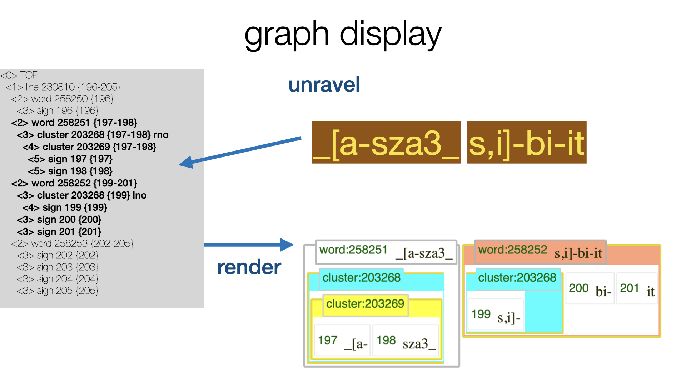

# Display design

In TF we want to display pieces of corpus material in insightful ways.

We have implemented two types of displaying:

*   `plain`: almost as the plain text of nodes, but with optional in-line 
    formatting
*   `pretty`: almost as a tree-bank view, but for the fact that the text objects
    are not merely trees, but graphs.

In both types of display it is possible to optionally show node numbers to the
relevant pieces of text, and to highlight nodes.

In addition to highlighting, the displays can be tweaked by passing a fair number of options,
in order to show of hide features of nodes, call in additional graphics, show or hide
intermediate levels, etc.

Whatever we want to display, we have to display in HTML, which is basically a
hierarchically organized set of presentation elements.

But a node and its constellation of relevant neighborhood nodes
does not have a hierarchical structure, in general, that is.

The unravel algorithm solves the problem of turning a node and its associated piece
of the textual graph into a tree of node fragments in such a way that the order
of the slots is preserved.

Unraveling is the core of the display algorithm in TF.
When nodes violate the hierarchy, the algorithm *chunks* and *fragments* them
and *stacks* the fragments into a tree.

See `tf.advanced.unravel`.

This tree of fragments can then be transformed in various kinds of HTML with rather
straightforward code, see `tf.advanced.render.render`.

Here is an account of how *unravel* works and which challenges it has to meet.

## Neighborhood

When we display a node, we consider all the slots to which this node is linked,
and then collect all other nodes in the corpus that share one or more of these slots.
(see `tf.core.locality.Locality.i`).

!!! explanation "with some subtleties"
    We exclude some nodes from the neighborhood, such as lexeme nodes, which have
    characteristics that require special treatment.
    We also exclude nodes of types that have a higher rank (read on).

### Descendant types

Node types are ranked: node types whose nodes occupy more slots on average have a higher rank
than types whose nodes occupy less slots on average.
You can inspect the ranking of the types in your dataset by `tf.core.nodes.Nodes.otypeRank`.

For each node type, we collect the set of descendant types: the types with lower or equal rank.
So each type is its own descendant. But we prevent the slot type from being its own
descendant.

## Discontinuity and chunking

The first problematic thing of nodes is that they can be linked to discontinuous sets
of slots, in other words: nodes may have gaps.
When nodes have gaps, and their holes are filled with other nodes, there is no way of 
walking through the nodes one by one and generating HTML boxes for them without
mixing up the order of the slots in the final display.

Here is an example from the Hebrew Bible:

> [Genesis 4:14](https://shebanq.ancient-data.org/hebrew/text?book=Genesis&chapter=4&verse=14&version=c&mr=m&qw=q&tp=txt_p&tr=hb&wget=v&qget=v&nget=vt),
> example taken from this [notebook](https://nbviewer.jupyter.org/github/annotation/tutorials/blob/master/zz_test/030-bhsa.ipynb).

You see a sentence fragment with two clauses, of which the second is engulfed by the first
one, while remaining completely disjoint.

We divide each node in our neighborhood into its maximal contiguous chunks.
Such chunk are specified by tuples `(n, b, e)`, where `n` is the node (an integer),
and `b` is the first slot of the chunk and `e` its last slot.

When we display nodes, we will typically generate solid borders at node boundaries and
dotted borders at internal chunk boundaries.

## Overlapping hierarchy and fragmenting

Chunks of nodes do not necessarily respect the borders of chunks of nodes that are higher in the
tentative hierarchy.

Here is an example from a corpus of Old Babylonian letters (cuneiform):

> [`Tablet P509373 reverse:6'`](https://cdli.ucla.edu/search/search_results.php?SearchMode=Text&ObjectID=P509373),
> example taken from [notebook](https://nbviewer.jupyter.org/github/annotation/tutorials/blob/master/zz_test/062-obb-clusters.ipynb).

Here you see a cluster that does not respect a word boundary.

We use the word boundary to break up the cluster in question into two *fragments*.
A *fragment* is, like a chunk, a continuous part of a node, but not necessarily maximal.

We fragment all node chunks in our neighborhood.

!!! explanation "with some subtleties"
    We work from higher levels to lower levels: node chunks of higher levels fragment
    node chunks of lower levels, not vice versa.
    And for nodes at the same level: bigger nodes chunk smaller nodes, not vice versa.

### Levels

As an example why levels are important, see Genesis 4:14 again.

In the Hebrew Bible, as encoded in the
[BHSA](https://github.com/ETCBC/bhsa), the usual sequence of division is:
sentence, sentence atom, clause, clause atom, phrase, phrase atom word.
Look at the middle clause. It coincides with its clause atom, phrase and phrase atom.
Without ranking information, TF cannot know which of these is the outer node and which
the inner node.
TF has computed this information when it loaded the corpus for the first time,
based on the average size of nodes. It is also possible that the corpus designer has overridden
this by an explicit ranking in the settings of the corpus app.

We end up with a rather fine partition of all nodes in fragments, in such a way
that no fragment crosses the boundaries of enclosing fragments.

### Canonical order

Before we feed fragments to the display, we sort them in *canonical order*, based on their
slots and node type. The following criteria will be checked *in that order*:

*   Chunks have different begin slots: those with earlier first slots have precedence;
*   Chunks with nodes with higher ranked types have precedence;
*   Look at the slots the chunks do *not* have in common.
    The chunk with the earlier such slot has precedence.
*   Chunks with nodes that are smaller as integer have precedence.

See `tf.core.nodes.Nodes.sortKeyChunk`.

### Stacking

When we have a list of canonically ordered fragments, we can stack them into a tree.
Each new fragment is tried against the right-most branch of the tree under construction,
from bottom to top. 
If there is no place on that branch, a new right-most branch is started.

### Output

When we render a tree of fragments, we produce output for the fragments, one by one.
For each fragment, the output consists of a contribution by the node of the fragment.
