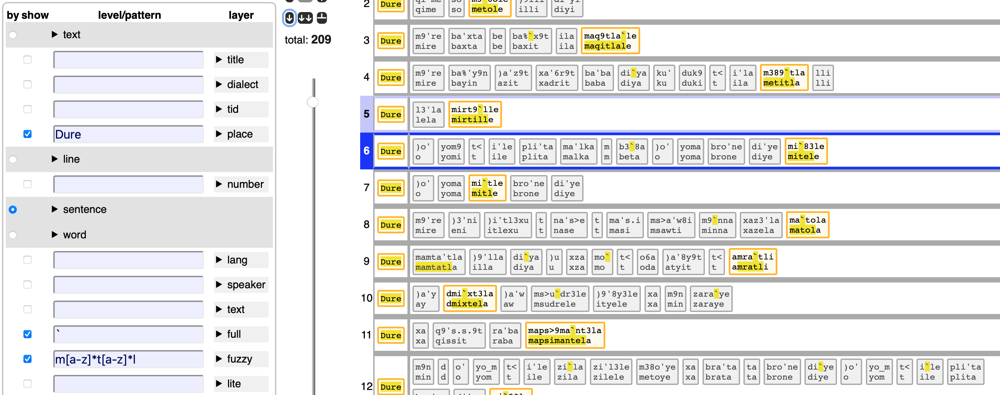
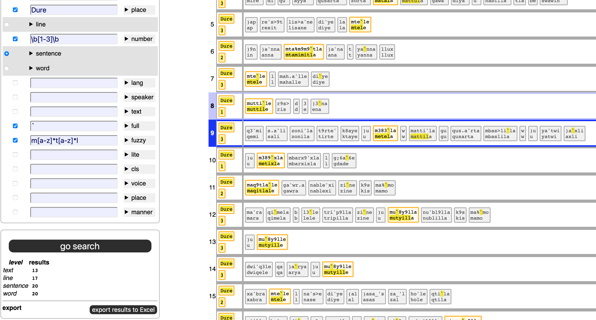
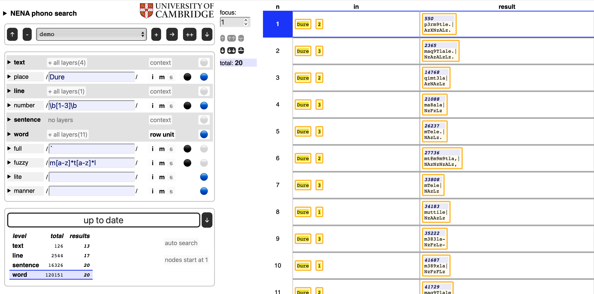
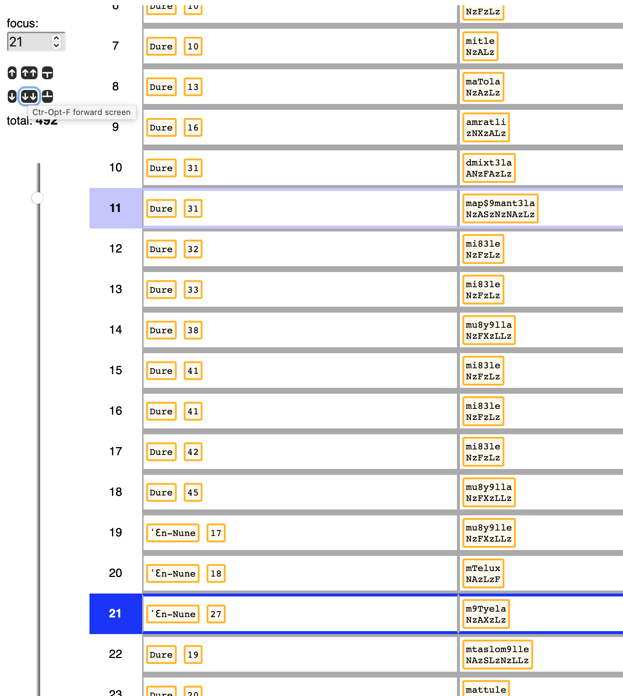
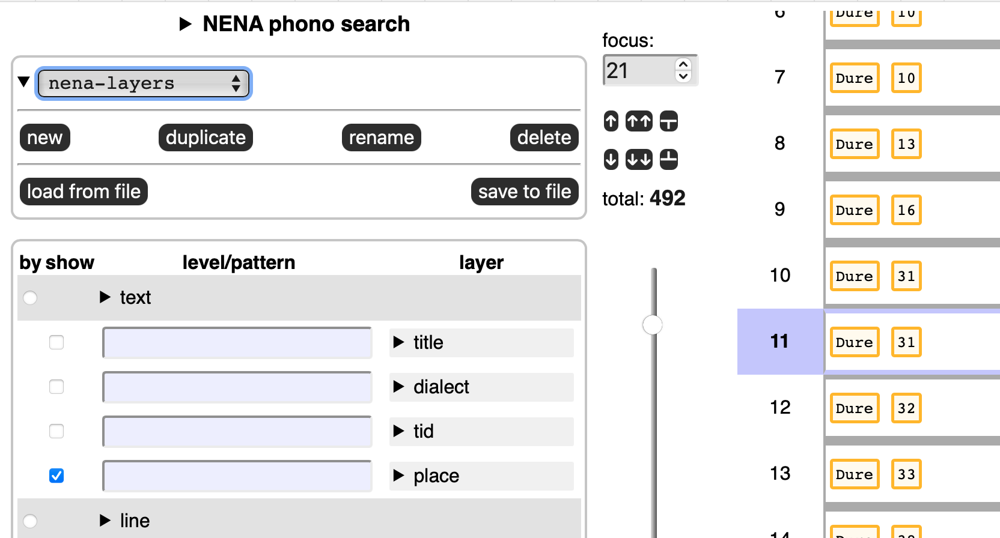

# Layered Search

This is a way of full-text searching your corpus by means of
[regular expressions](https://developer.mozilla.org/en-US/docs/Web/JavaScript/Guide/Regular_Expressions/Cheatsheet),
but with a twist to make use of the annotations made to items in the corpus at various levels.

## Corpus in layers

Your corpus is divided into levels, e.g. book/chapter/verse/sentence/word/line/letter.

At each level the items of corpus can be represented in certain ways:

* books are represented by book titles;
* chapters and verses are represented by their numbers;
* words and letters are represented by the strings of which they are composed.

Per level, there may be more than one way to represent the items.
For example, for the word level, you may have representations in the original script in unicode,
but also various transliterations in ascii.

All these representations are *layers* that you can search.
Here you can see how that looks like for the
[NENA corpus](https://github.com/CambridgeSemiticsLab/nena_tf)
which contains various text representations, among which several are dedicated to phonetic
properties.


Layers do not have to correspond with the text of the corpus.
For example, you can make a layer where you put the part-of-speech of the
words after each other. You could then search for things like

```
(verb noun noun)+
```

We'll stick to NENA for examples of layered search.

## Combined search

In order to search, you specify search patterns for as many of
the available layers as you want.

When the search is performed, all these layers will produce results,
and the results per layer will be compared, and only results that
hold in all layers, filter through.

So, if you have specified 

level | layer | pattern
--- | --- | ---
**word** | **fuzzy** | `m[a-z]*t[a-z]*l`

you get all words with an `m`, `t`, and `l` in it, in that order.
There are 1338 such words in 1238 sentences.


By clicking on the checkbox next to the **full** layer,
you will see the full-ascii transliteration of these results as well.

> Click on "+ all layers" and "- active layers" to expand to all layers of a level
and to collapse back to the active layers.


You can specify an additional search in the **full** layer, for example
all words with a backquote \` in it. (A combining vowel diacritic).

We then get the words that meet both criteria, still a good 492:


level | layer | pattern
--- | --- | ---
**word** | **full** | \`
**word** | **fuzzy** | `m[a-z]*t[a-z]*l`

You can also constrain with other levels.
Suppose we want only occurrences of the previous results in texts
written at the place *Dure*.

level | layer | pattern
--- | --- | ---
**text** | **place** | `Dure`
**word** | **full** | \`
**word** | **fuzzy** | `m[a-z]*t[a-z]*l`



You can go even further, we want them in the first 3 lines of the texts:

level | layer | pattern
--- | --- | ---
**text** | **place** | `Dure`
**line** | **number** | `\b[1-3]\b`
**word** | **full** | \`
**word** | **fuzzy** | `m[a-z]*t[a-z]*l`

Still 20 results.



## Additional controls

The interface gives you additional ways to control how the results of your
search are being displayed.

**Row unit**:
In each level you see either the term **row unit** or *context* or *content*.

The row unit is the level that corresponds to each individual result in the
results table. Higher levels are *context* levels, lower levels are *content* levels.

Each result mentions the corresponding results in the *context* levels.

Each result contains all material in the *content* levels.

*Example:* if the **row unit** is `sentence`, then each result contains
exactly one sentence. 
Together with that sentence, the `line` and `text` in which it occurs are mentioned.
Inside the sentence, all of its `words` show up.
Not all of them match, but the ones that do are highlighted.

By varying the row unit, you can provide more or less context
to your search results.

We can select **word**, to get a much more compact overview:


**Flags**
The behaviour of your patterns can be changed by means of three flags, which are familiar
citizens in the regular expression world:

flag | mnemonic | meaning | default
--- | --- | --- | ---
i | ignore | ignore case | on
m | multiline | `^ $` also match around embedded newlines in the string | on
s | single string | `.` also matches the newline character | off

**Enable/disable patterns**:
In each layer you see a black or red button.
Only the patterns in black layers are actually working, the red ones are skipped.
It is as if you had not typed anything there.

This way you can experiment with the cumulative effect of patterns in different layers,
without the need to type them over and over again.

**Show layers**:
In each layer you see a blue or grey button.
Only the blue layers will show up in the search results.

Note that you can show layers in which you did not search,
and you can hide layers in which you did search.

For example, lets look at the **lite** and **manner** layers
only (within the word layers):



Here we have also shown the layers `text-place` and `line-number`.

Observe that we can also show the levels themselves.
What you then get is the `node` layer.
Nodes are internal numbers of objects.
In Text-Fabric they are numbered from 1 for the first word or letter to a big number
for the very last object.

It might be more convenient to you to number the objects separately, starting at 1 in each level.

There is an option by which you can choose what you like.

### Execute

When you click the big button, the search is executed and results get displayed.

Also, when you change your patterns, the search will be executed, to always reflect
your input.

But you can switch these auto-search off with an option, after which you have to
manually press the button in order to see the results.

Right below the button the number of items found appear, specified per level.

### Results table

There might be (very) many results.
Displaying them all might quickly overwhelm your browser.
The interface only shows a screenful and then some,
but you have various devices to move through them fluidly.

By means of the slider you can wade through the results, and set the focus
position, i.e. the position in the table around which you want to see
some results.

The row that is in focus is clearly marked by a clear blue border,
and the row that had focus just before has a dim blue border.

You can also type that position into a box.
And you can shift the focus by one or a half screen in both directions.
Or go to the first or last result.

There are keyboard shortcuts for all of these controls (except the slider).
If you hover over them, you see what the shortcut is.

All shortcuts need `Ctrl+Option`

shortcut | direction | amount
--- | --- | ---
`m` | NA | manual entry of the result number
`n` | **n**ext | one
`p` | **p**revious | one
`b` | **b**ack | a batch (half a screenful)
`f` | **f**orward | a batch (half a screen)
`s` | **s**tart | all the way
`e` | **e**end | all the way



## Jobs

Your search instructions together are called a *job* and it has a name.
You see it on the interface, and you can add new jobs,
duplicate and rename existing ones, delete some, and switch
between all jobs that your browser has remembered.



Indeed, your browser will remember your jobs (not through cookies! but for your eyes only).

Sometimes you do want to have other eyes look at your searches.
So you can share jobs by saving them first to a little file and then sharing that file
by any means you find convenient: mail, message, twitter , etc.

A job file is a small `.json` file that only contains the search patterns
and display settings of the job.

## Results export

You can also export the search results to Excel (or rather, a tab-separated file, `.tsv`).
When you do that, *all* results will get exported, not only the ones that show
on the interface.


The organization of the exported results is as follows:
for each result item a row is made.

The first column is an identifier for that item: a number.
It is the sequence number of the item among the items in its level.
Or, if you have the option active to show Text-Fabric node numbers instead, that is the number.

In the first case, the header field will be `seqno`, in the second case `node`.

The second column is the level of that item: `text`, `word`, etc.,

And then follow columns for the individual layers, and the corresponding
cells are filled with the values of the nodes in those layers, with
the parts that match the search between `«` and `»`.
Only layers that have their `show` checkboxes marked will make it to
the Excel file.

Some layers work with acronyms, instead of the real corpus values, e.g. `speaker` and `lang`.
In the export you see these back with their expansion, like so `1 (=Dawið ʾAdam)`.

By the way, you can see these expansions also on the interface, in the legend, and
as a tool tip.


# The app

We have implemented layered search as an offline Single Page Application.

The app consists of a single HTML file (`index.html`),
a CSS file, PNG files (logos) and Javascript files.
The corpus data is in a big Javascript file, the corpus configuration in a small one.
The remaining Javascript files are the modules of the program.

Modern browsers can take in modular Javascript, except when you have the HTML file
locally on your computer and you open it with a double click.
Your browser has then `file://` in its URL bar, and in that cases modular Javascript does
not work.

To overcome that, we have also bundled the program in a single file, and that is included by
`local,html`.

If you are in the app, you can download a zip file with `local.html` in it,
so that you can have the full search experience completely off-line.

Also when you have opened this page over the internet, your browser has downloaded the
complete app, and all interaction between you and the search app happens at your browser,
without further internet connection.

As a consequence

* this app works without any kind of installation
* it does not collect data about you
* it does not use cookies.
* it works without internet connection

When the browser remembers your previous jobs,
it does not use cookies for it but
[localStorage](https://developer.mozilla.org/en-US/docs/Web/API/Window/localStorage),
which other sites cannot read.

# Making this app

The construction of this app relies very much of the organization of the corpus
as a Text-Fabric dataset.

The layered search functionality is not (yet) baked into Text-Fabric.
We have created the first layered search interface for the 
[NENA](https://github.com/CambridgeSemiticsLab/nena_tf)
corpus, by means of a Python program
[mkdata](https://github.com/annotation/app-nena/blob/master/mkdata.py).

We intend to make such interfaces for other Text-Fabric corpora, using more
streamlined ways.

# Credits

The idea for this app came out of a discussion of
[Cody Kingham](https://www.linkedin.com/in/cody-kingham-1135018a)
and me about how we could
make a simple but usable search interface for people that need to get hand on with
the corpus in the first place.

Given that we have the corpus data at our finger tips through Text-Fabric,
but that TF-Query (`tf.about.searchusage`) is over the top, and requires installing Python
and almost programming, the approach is to assemble data and power a simple Javascript
program with it.

This implementation of the idea was funded by
[Prof. Geoffrey Khan](https://www.ames.cam.ac.uk/people/professor-geoffrey-khan),
and eventually written by
[Dirk Roorda](https://pure.knaw.nl/portal/en/persons/dirk-roorda).
