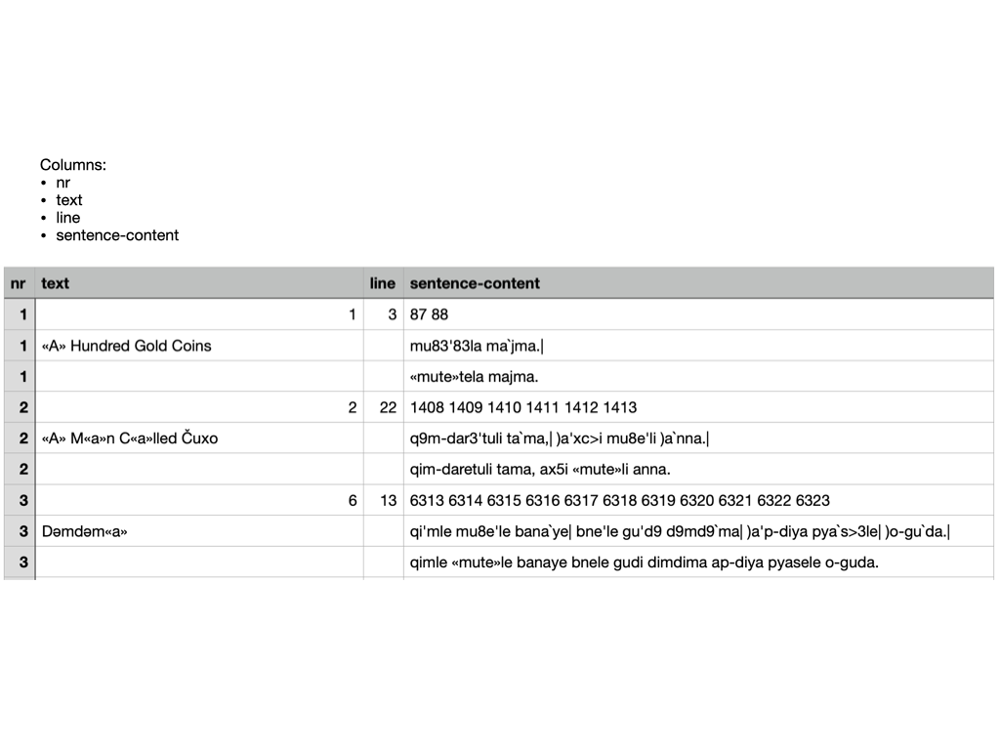
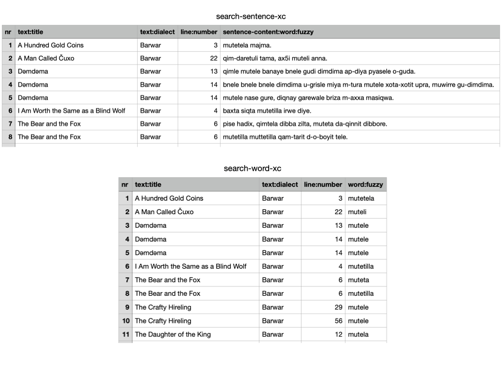

# Search manual


<mark>1. patterns</mark>
:   You can search the corpus by means of patterns.
    Several patterns work together at different levels of the corpus.
    When all patterns match, we have a result.
    All results will be listed in the table on the right.

    A pattern can be as simple as a word, and then it will find all occurrences of that word.
    But they can be way more sophisticated than that.
    See **Search patterns** below for a crash course.

<mark>2. focus</mark>
:   The level in the corpus that corresponds with a single row in the results table.
    For example, if you put focus on `sentence`, the results will be organized by sentence.

    !!! hint "More or less context"
        By changing focus, you will see more or less context around the results.

<mark>3. execute</mark>
:   Whenever you change a pattern, the search results will be updated.
    But you can also press this button to run the search again.

<mark>4. stats</mark>
:   How many results there are at each level, compared to the total size of the corpus.

<mark>5. export</mark>
:   Export the search results as a tab-separated file (`.tsv`).
    This file can be opened in Excel.
    All  results are exported, not only the ones that show on the current page.
    The level of detail depends on the currently selected **focus** level.

<mark>6. options</mark>
:   Switch between the simple interface and the full interface.
    There is a separate manual for the full interface: `tf.about.clientmanual`.

<mark>7. help</mark>
:   Help and info.

<mark>8. navigate</mark>
:   Walk through the results in various ways:

    *   manual entry of the position number,
    *   small jumps back and forth,
    *   big strides with the slider.

    If you do this often: there are handy **keyboard shortcuts**. See below.

<mark>9. position</mark>
:   The current position in the results table is marked.

<mark>10. previous position</mark>
:   The previous position in the results table is also marked,
    in a slightly less conspicuous way.

<mark>11. highlighting</mark>
:   The portions in the layer that match the corresponding pattern are highlighted.

    !!! caution
        When you export results, the highlight information is lost.

    !!! hint
        There is an option to retain highlight information in exports.
        For that you have to use the full interface.
    
## Search patterns

Here is a crash course in increasingly complex search patterns.
We only give examples and a bit of explanation.

Simple words
:   `mute` is a pattern that matches all occurrences of the string `mute`.
    Case is not important, and it does not have to be a whole word.

    <mark>if the case of letters is important, use the full interface.</mark>

Word boundaries
:   We can reckon with word boundaries:

    *   `\bmute\b` matches `mute` but only if it is a separate word.
    *   `\bmute` matches words that start with `mute`
    *   `mute\b` matches words that end in `mute`

Line boundaries
:   We can reckon with line boundaries:

    *   `^mute$` matches `mute` but only if it occupies a complete line;
    *   `^mute` matches occurences of `mute` at the start of a line;
    *   `mute$` matches occurrences of `mute` at the end of a line.

    !!! hint "match literally"
        You can take these special characters literally by using `\$` and `\^`.

Wildcard
:   `m.te` matches `mate`, `mbte`, `mcte`, `m,te`, `m te`, etc.

    The `.` matches any character, except a newline.

    !!! hint "newline"
        To match a newline, use `\n`

Small variations
:   `m[aeiou]te` matches `mate`, `mete`, `mite`, `mote`, `mute`.

    With `[ ]` you can define a character class.
    Everything in the class is matched.

    There are more possibilities:

    *   `[0-9]` matches all single digits
    *   `[a-z]` matches all single letters
    *   `[p-w]` matches all single letters between `p` and `w` (including)
    *   `[a-ep-w:;!?]` matches the letters `a` to `e`, `p` to `w`, `:`, `;`, `!`, and `?`.
    *   `[a-e-]` matches the letters `a` to `e` and `-`.
        (The `-` should be right before the `]`).
    *   `[^aeiou]` matches every character *other than* a vowel
    *   `[(){}\[\]]` matches the letters `(`, `)`, `{`, `}`, `[`, and `]`.
        Note that you have to use \ in front of the `[` and `]` to undo their special meaning.

Smaller variations
:    `mute|nase` matches either `mute` or `nase`.

Grouping
:   We can group patterns

    *   `mu(t|r)e` matches `mu` followed by either `t` or `r`, followed by `e`
    *   `(^|a)mute` matches `mute` at the start of a line, or `amute`

Repetitions
:   We can specify that a pattern should match a number of times:

    `?` means 0 or 1 times:
    :   `p[aeiou]?r` matches a `p`
        followed by an optional vowel,
        followed by an `r`.

    `+` means 1 or more times:
    :   `p[aeiou]+r` matches a `p`
        followed by at least one vowel,
        possibly more vowels,
        followed by an `r`.

    `*` means arbitrary many times:
    :   `p[aeiou]*r` matches a `p`
        followed by any number of vowels,
        possibly none at all,
        followed by an `r`.

    `{3,7}` means at least 3 and at most 7 times
    :   `ma{3,7}t` matches an `m`, then 3-7 `a`s, and then a `t`.

    `{3,}` means at least 3 times
    :   `ma{3,}t` matches an `m`, then at least 3 `a`s, and then a `t`.

    `{,7}` means at most 7 times
    :   `ma{,7}t` matches an `m`, then at most 7 `a`s, and then a `t`.

    The quantifiers `?`, `+`, `*` try to make as many repetitions as the
    text admits. But you can reign them in so that they make as few repetitions as possible,
    by putting a `?` behind them: `??`, `+?`, `*?`.

    Suppose we search the string

    ```
    mute aaaa nase bbbb nase cccc
    ```

    *   `mute .* nase` matches `mute aaaa nase bbbb nase`
    *   `mute .*? nase` matches `mute aaaa nase`

    However:

    *   `mute .* nase bbbb` matches `mute aaaa nase bbbb`

    Initially, the `.*` takes us to the *second* `nase`,
    but the pattern wants a `bbbb` at the end, so it has gone to far
    and it will, reluctantly, backtrack, until the match is found.

    *   `mute .*? nase cccc` matches `mute aaaa nase bbbb nase cccc`

    Initially, the `.*?` takes us to the *first* `nase`,
    but the pattern wants a `cccc` at the end, so it has gone not far enough
    and it will, reluctantly, go further, until the match is found.

Combining
:   By using the constructions we have so far, we can specify ever more complex patterns.

    *   `\b[^aeiou]{2}[aeiou][^aeiou]+\b` matches a word
        consisting of exactly 2 consonants, one vowel, and then one or more consonants.
    *   `\b([^aeiou][aeiou][^aeiou]|[^aeiou]{2}[aeiou][^aeiou]{2})\b`
        matches a word of shape CVC or CCVCC.

    If there is more than one group, you can refer to them by `\1`, `\2`, etc.

More power
:   Groups between `( )` have memory. If something is matched by it, you can 
    reuse is later in the pattern. If we have one pair of `( )`, then
    `\1` refers to whatever that group matched.

    *   `([^aeiou])\1` matches twice the same consonant, no matter which one
    *   `([^aeiou])\1{3}` matches 4 times the same consonant.
        This will find words such as `xirrrr`.
    *   `(\b([a-z]+)\b).*?\b\1\b` finds twice the same word in a sentence

    Note that `[^aeiou]{4}` will find 4 consonants, but they do not have to be 
    the same.

Ultimate power
:   This is not all. Much more can be done with patterns.
    The full story is here:

    *   [cheatsheet](https://developer.mozilla.org/en-US/docs/Web/JavaScript/Guide/Regular_Expressions/Cheatsheet)
    *   [regex](https://en.wikipedia.org/wiki/Regular_expression)

## Export

You can export the search results to Excel (or rather, a tab-separated file, `.tsv`).
When you do that, *all* results will get exported, not only the ones that show
on the interface.

The organization of the exported results reflects the interface.
Here are screenshots of an export where the focus is on sentences,
and one with the focus on words.
Observe the different amount of context in the export.



## Keyboard shortcuts
Keyboard shortcuts need to be pressed with modifier keys.
It depends on your browser which ones.
Here is the list, by browser and platform:

browser | Windows | - | Linux | - | Mac
--- | --- | --- | --- | --- | ---
Firefox | <kbd>Alt</kbd> + <kbd>Shift</kbd> | | <kbd>Alt</kbd> + <kbd>Shift</kbd> | | <kbd>Ctrl</kbd> + <kbd>Option</kbd> 
Chrome | <kbd>Alt</kbd> + <kbd>Shift</kbd> | | <kbd>Alt</kbd> | | <kbd>Ctrl</kbd> + <kbd>Option</kbd> 
Edge | <kbd>Alt</kbd> + <kbd>Shift</kbd> | | | | <kbd>Ctrl</kbd> + <kbd>Option</kbd> 
Safari | | | | | <kbd>Ctrl</kbd> + <kbd>Option</kbd> 

Having figured that out, you can use those modifier keys together with a letter
to perform the following actions:

shortcut | action
--- | ---
`n` | **n**ext position
`p` | **p**revious position
`b` | **b**ack a batch
`f` | **f**orward a batch
`s` | **s**tart
`e` | **e**nd
`m` | **m**anually type the position in the box
