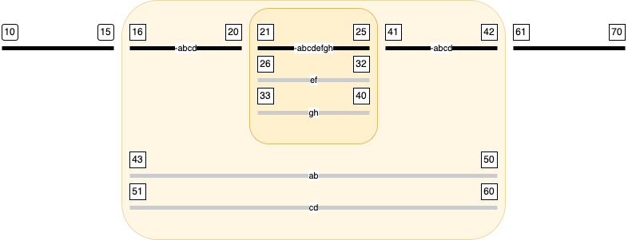

# Sentence boundaries in textual variants
The TEI guidelines describe an element `<app>` for the encoding of textual variants. For a short overview see the
[Critical Apparatus Module](https://www.tei-c.org/release/doc/tei-p5-doc/en/html/examples-lem.html#TC).
We have a corpus with textual variants in which there is no explicit encoding of sentences. When we try to add them, we are confronted with the problem that sentence boundaries may be different in different variants.
The problem is: how to encode them?
When we try to do this in XML, the problem becomes utterly hard. However, in the Text-Fabric context there is no obligation to put the sentences in a single tree hierarchy.
We have to make sentence nodes such that:
* all textual material in all variants is properly assigned to sentence nodes
* for each variant, we can enumerate the sentences in the proper order
* sentences within a variant are consecutive and non-overlapping
* sentences are economical: we want as few variant-dependent sentence nodes as possible

First we sketch what the result will look like, then we describe the algorithm to achieve that result, and finally we explain how you can invoke the Python module that implements the algorithm.
# The app element
The `<app>` element with its subelements `<lem>` and `<rdg>` describe textual variants.

``` xml
base text (all witnesses)  
<app>  
    <lem>  
        base text (not in a b c d)  
        <app>  
            <lem>base text (not in a b c d e f g h)</lem>  
            <rdg wit="e f">variant text (in e f)</rdg>  
            <rdg wit="g h">variant text (in g h)</rdg>  
        </app>  
        base text (not in a b c d)
    </lem>  
    <rdg wit="a b">variant text (in a b)</rdg>  
    <rdg wit="c d">variant text (in c d)</rdg>  
</app>
base text (all witnesses)
```
It is assumed that text outside any app-element is the base text, as well as the content of the lem-elements. The material in the rdg-elements (reading groups) are variants on their sister lem-element.
Each reading group specifies in its `wit=` attribute which witnesses contain that variant. The base text in the lem-element is witnessed by all witnesses, except those that are mentioned in its sister rdg elements.
Lem-elements can contain app-elements in turn. That means that a part of the outer lem-element is itself subject to additional variation, contained in the inner rdg elements. The base text in the inner lem element is witnessed by all witnesses, except those mentioned in its sister rdg-elements, and in its *aunt* rdg-elements. See the following picture.


In the sequel we will use pictures like this a lot, so here are some points to remember:
* a coloured area represent an app element
	* its top black bar is the content of the lem-element
		* which may be partly contained in the lem-element of a nested app element
	* the grey bars below are the content of the rdg-elements
* the black bars represent the base text;
	* labels start with `-` and indicate the witnesses that do *not* support the base text;
* the grey bars represent the variant texts;
	* labels indicate the witnesses that support the variant in question
* the numbers represent textual positions (slots), in the order in which they occur in the source file.
	* this is also the reading order of the base text if you skip the variants
	* and it is the reading order of each witness, if you follow the base text except for app-elements that have an rdg with this witness in its wit attribute.

# From boundaries to nodes
Suppose you want to encode sentences. You could start by marking sentence boundaries at every `.` that has the function of sentence separator.
We do not deal with the non-trivial problem of detecting sentence boundaries here. They might have been assigned by hand and encoded as milestones or processing instructions, or they might have been found by applying some heuristic guidelines of more or lesser quality.
We assume that all sentence boundaries have been found.
The problem arises when we want to define sentence elements out of the sentence boundaries. Because a sentence can start in the base text, and end in different variants in different ways.
When that happens, we want to split the sentence into multiple elements, one for each variant. But we do not want to duplicate the words in those sentences.

Here is a diagram that shows the problem in its generic complexity.


We see nested app elements with intricate variations. Here is what to look for:
* there is an unequal number of sentence boundaries between the base text and its variants; this happens in the outer app and in each of the two inner apps
* the variants are divided over sets of witnesses in each app, but the two inner apps have incompatible sets of witnesses in their variants: the first one has a variant for witnesses `a` and `b`, while the second one has a variant for witnesses `b` and `c`
* there is *no* sentence boundary between the two inner apps. So unfinished sentences from the left inner app continue through the base text to the right inner app, where they may or may not be terminated in either the base text or in a variant
* look at variant `g`:
	* it shows up in the left inner app, where it continues the sentence started in the base text at slot `5`
	* in the left inner app, the variant is also witnessed by `f`
	* it is not finished in the left inner app but continues through the base text in slots `28-33`
	* then it enters the right inner app, in a variant that is no longer witnessed by `f`, but by `h` instead
	* it is not finished in the right inner app, but continues through the base text from slot `53` till `55`, where it is terminated.
	* All in all, this particular sentence in `g` has the slots `5-7, 22-27, 28-33, 47-52, 53-55`
* look at the sentence in variant `f`:
	* like the one in `g` it has the piece `5-7` in the base text
	* and also the piece `22-27` in a variant shared with `g`
	* from where it continues with `28-33` in the base text
	* but in the right inner app there is no variant for witness `f`, so here `f` follows the base text, which terminates the sentence at the end of piece `34-35`.
Hopefully, this builds some intuition how sentences run through witnesses.
When we do this for all sentences and witnesses, we get this end result.


* the base text and each individual witness will get their own, separate set of sentence nodes
* triangles open and close sentence nodes
* rhombes close a sentence node and open the next one
* half circles suspend and resume sentence nodes

Let's walk through the diagram to see where all the sentence nodes start, are suspended, resumed, and finally end. When doing so, we will encounter steps that will be not trivial to perform, a fact that we have to solve in our algorithm.
We are not there yet, so the following steps are not yet the algorithm, but just a description of the result.

* `1`:  the start of a sentence node in the base text. It is also the start of sentences in witness `d` and `e`, because these witnesses will continue this part of the sentence in different ways than the main text. **It is a challenge for the algorithm to find the starting point for variant sentences.**
* `4`: the start of the outer app where there are variants for witnesses `d` and `e`, but first we encounter the lem-element where the base text continues, and hence the first sentence continues without interruption
* `5`: stil in the lem-element, the first sentence in the base text terminates, and a new one is started.
* `5`: it appears that this is also the point where several sentences in the individual witnesses must start. For example, in the left inner app there is a variant in witnesses `a` and `b` that has a sentence boundary, at `17`. If you travel back from there along the text of `a` and `b`, you see that here at `5` is the corresponding sentence boundary. Likewise, you'll see that in `f` and `g` there must also start a sentence here. **This is a challenge for the algorithm later**.
* `7`: the left inner app looms, in which the base text continues in its lem-element. Onnce in that element, we will have base text that does not occur in the witnesses `a b f g`. So the sentences in those witnesses that have already started, must be suspended at this point. Hence those half circles.
* `8`: inside the inner lem-element the second sentence of the base text continues.
* `10`: the second base text sentence ends, and the third one is started.  It also appears that we must start a sentence in witness `c` here. That is because of the boundary at `42`, where variants `b` and `c` have a sentence boundary. This boundary is the for witness `c` the first witness-specific boundary. Likewise, a sentence in witness `h` starts here, because there appears to be a variant for `g` and `h` with a running sentence at `47`. **The algorithm needs to extricate individual witnesses out of the variants that are shared by multiple witnesses.**
* `12`: the lem-element in the left inner app ends, and all running sentences at this point must be suspended, which are the third base text sentence and the sentence in `c` that is running.
* `13`: we dive in the variant witnessed by `a` and `b`. The running sentences in these witnesses can be resumed.
* `17`: a sentence break in this variant. The running sentences in `a` and `b` are terminated, and new ones are started.
* `21`: end of this variant, we suspend the running sentences in `a` and `b`
* `22`: we dive in the variant of witnesses `f` and `g` and resume their running sentences.
* `27`: end of this variant, we suspend the running sentences in `f` and `g`
* `28`: back in the base text we resume all suspended sentences. Note that this includes all sentences of the rdg elements that are now closed, because they are not yet finished, they will be finished by a later sentence break.
* `33`: the right inner app looms, the base text continues, so all running sentences can continue, except the ones that are taken up in the rdg elements of the app. That is why we have to suspend `b`, `c`, `g`, and `h`.
* `34`: the base text continues in the lem element of the right inner app. Running sentences in all witnesses except the ones mentioned in the rdg elements can continue, which are sentences in `a` and `f`.
* `35`: a sentence boundary. The running sentence in the base text is terminated and a new one started. The running sentences in `a` and `f` are terminated as well, since `a` and `f` agree with the base text here. For the same reason, no new `a` and `f` sentences are opened here, and for the fact that there is no further material specific to `a` and `f` before the next sentence break in the base text.
* `37`: the lem-element in the right inner app ends, and all running sentences are suspended, which is only the current sentence in the base text.
* `38`: we dive in the variant witnessed by `b` and `c` and resume running sentences in these witnessed. **Note that in `c` we have a running sentence that triggered the creation of the sentence already at slot `10`.**
* `42`: a sentence break in this variant. The running sentences in `b` and `c` are terminated, and new ones are started.
* `46`: end of this variant, we suspend the running sentences in `b` and `c`
* `47`: we dive in the variant witnessed by `g` and `h` and resume their running sentences. **Note that in `h` we have a running sentence that triggered the creation of the sentence already at slot `10`.**
* `52`: end of this variant, we suspend the running sentences in `g` and `h`
* `53`: back from the inner app in the base text we resume all suspended sentences. Note that this includes all sentences of the rdg elements that are now closed, because they are not yet finished, they will be finished by a later sentence break.
* `55`: a sentence boundary. The running sentence in the base text is terminated and a new one started. The running sentences in `b`, `g`, `c` and `h` are terminated as well, since these witnesses agree with the base text here. For the same reason, no new witness-bound sentences are opened here.
* `58`: now we are about to end the lem-element of the outer app. We suspend the running sentence in the base text
* `59`: we dive in the variant witnessed by `d` and resume its running sentence. 
* `64`: this variant ends and we suspend the sentence in `d` since it is not yet finished. 
* `65`: we dive in the variant witnessed by `e` and resume its running sentence. 
* `68`: a sentence break in this variant. The running sentence in `e` is terminated, and a new one started.
* `70`: this variant ends and we suspend the sentence in `e` since it is not yet finished. 
* `71`: back to the main text, outside all app elements. We resume the running sentence in the base text, and the suspended left overs in the variants for `d` and `e`.
* `75`: a sentence break in the main text. All running sentences can be terminated now.
# Processing `<app><lem><rdg>`
At this point we understand what sentence division means in the presence of variant texts. We know that for each individual witness we have to make sentence nodes for each sentence of which a part differs from the main text.
The problem is that the app-lem-rdg-elements neatly wrap themselves around the differences, but that the sentences in which these differences are contained may spread outside these elements. This spreading may extend over multiple other app elements, which can also be nested.
When we process the text from left to right, we encounter locations where we have to insert witness-dependent sentence starts before we have seen any hint of the presence of that witness.
We solve that problem as follows:

1. in a first, preparatory pass, we walk through the complete text and collect for each app-element the witnesses dat occur in its rdg elements
1. in the second, node-generating pass, we know, upon entering an app element, which are the witnesses of its variants in the rdg elements.
1. if we start processing an rdg element, there are several cases:
	1. the content starts with a new sentence: no problem, we generate a new sentence node for the witnesses of that rdg on the spot
	1. the content starts in the middle of a sentence:
		a. we have seen that witness before: that means there is currently a suspended sentence in that witness, and we resume it on the spot
		b. we have not seen that witness before: that means the following sentence part continues a sentence in the base text that was suspended just before this app-element started: we make a copy of that suspended sentence.

The last case is possible if we remember the last suspended sentence part in front of each app-element. Because app-elements can be nested, we remember these fragments on a corresponding stack.

We also need to remember the current sentence fragments that are in progress.

With this information in hand we are able to make every decision we need to make with the information that is accessible at the moment that the decision is required.

# Walker conversion
The context of the algorithm is the *walker* conversion by which we issue node-creation statements and where slots are automatically added to all current nodes that are not yet terminated. See `tf.convert.walker`.
Because of this environment we can now specify the information that we maintain while walking through the TEI source.
## Creating, terminating, resuming nodes
We create a sentence node by issuing a statement
```
s = cv.node("sentence")
```
If the node is witness dependent, we give it the feature `wit` with the name of the witness as value, e.g. for witness `a`:
```
cv.feature(s, wit="a")
```
Now the sentence node `s` is open, new slots are automatically linked to `s`.
But we must remember that `s` is a currently active sentence for witness `a`.

We assume that we have a big dictionary `cur` in which we have a subdictionary `cur["sentence"]` in which we can store this information:

```
cur["sentence"]["a"] = s
```

And so we do for all witnesses in which we build sentences.
We also do it for the base text, which we remember as

```
cur["sentence"][""] = s
```

If the rdg that contains witness `a` comes to an end, we end this sentence `s`:

```
cv.terminate(s)
```
As far as the walker machinery is concerned, the `s` is now terminated. Now, if the rdg ended with an unfinished sentence, we keep `s` in `cur["sentence"]["a"]` so that we can resume `s` when needed.
That is the case when we enter an other rdg for which `a` is a witness, or when we return to the base text before having passed a sentence boundary.
In those cases we do

```
cv.resume(s)
```
If we encounter a sentence boundary at the end of an rdg element for witness `a`, we terminate `s` and we remove `cur["sentence"]["a"]`, so that this sentence node will not be resumed later.

## The stack
For each app-element, we must remember the sentence in the base text that leads to the start of this app or rather which slots that sentence contains.
Because, whenever we enter one of its `rdg` elements, and that element starts with an unfinished sentence, it is a continuation of that leading sentence.
Because apps are nested, we remember these values on a stack.
If we are outside any app-element, the stack is empty.

```
cur["appstack"] = []
```
When we encounter an `app` element, we add a new value on the stack. We retrieve the current sentence in the base text, and find out which slots have been linked to that sentence so far. It goes as follows:

```
n = cur["sentence"][""]
slots = cv.linked(n)
cur["appstack"].append(slots)
```

And whenever we encounter an rdg whose material must be prepended with these slots, it works as follows:
```
w = cv.node("sentence")
cv.feature(w, wit="a")
slots = cur["appstack"][-1]
cv.link(w, slots)
```
When we have finished the last rdg of an app, we leave the app and do
```
cur["appstack"].pop()
```
This solves the problem of having to create witness dependent nodes before we can know that we have to do so. We postpone the creation of such nodes until the moment that we are confronted with the witness for the the first time, and at that moment we link exactly the right slots to that node in one go, before we rely on the automatic slot-linking machinery of the walker conversion.