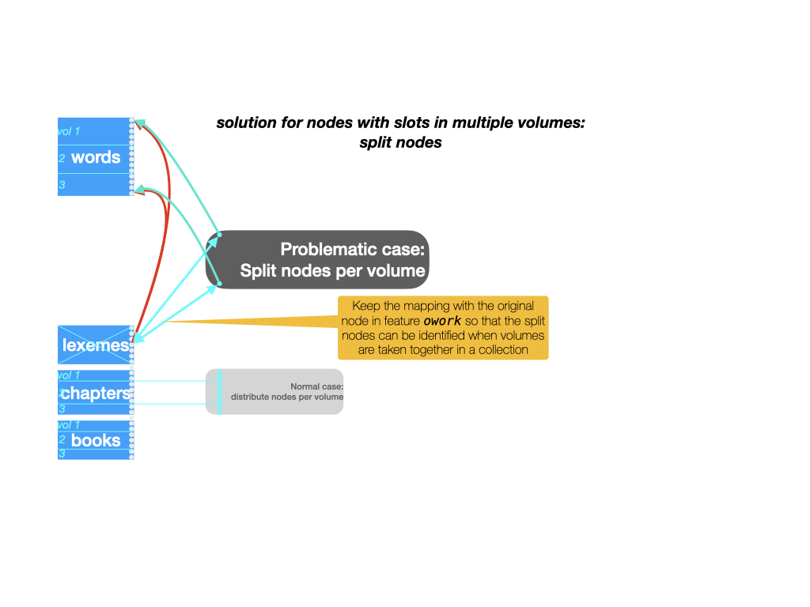
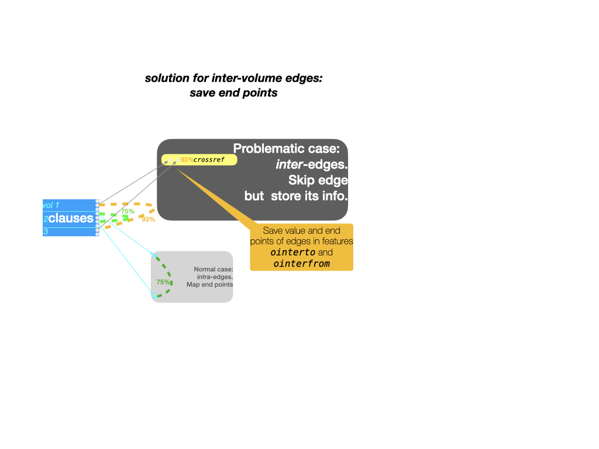

# Volumes and collections

As from version 9.0.0, TF supports working with partial datasets.

## Concepts

TF supports the concept of volume of a work and also the concept
of a collection of volumes.

It has methods to restrict the loading of data to a single volume or a single
collection of volumes.

Volumes and collections can be created from works by means of ready made
functions in TF.

When volumes and collections are created, a profound rearrangement of information
takes place. Yet the nodes in the portions can be mapped unto the nodes of the
original work.

That means that if you work inside a volume or collection, and produce results,
you can translate these results back to the original work.

## Rationale

There are various reasons for working with portions.

Many corpora have a division in volumes that are relatively self-contained.
When you do intensive processing that can be done inside a volume, it is a waste
of time and other resources to load the whole corpus into RAM.

Sometimes corpora are so large that there is no hope to fit them into RAM anytime soon.
In those cases we need TF to be able to work on its portions.

What we do not have yet is a concept of a work that is not meant to be loaded entirely
into TF, but only volume-wise.
Up till now the mechanism to create portions is dependent on being able to load
the whole work.

At the horizon there is the picture of large corpora lying in archives.
These archives offer an API to select a volume and export it as a TF volume.
Researchers can do their job, and produce new annotations to the volume,
which can be transformed into annotations to the work as a whole.

## Challenges

TF is heavily optimized around the idea that the whole corpus
is addressed by natural numbers, starting at 1 at the first slot of the text,
then going to the last word,
and then continuing by enumerating textual objects of several types, type for type.

When we extract a volume in order to turn it into a loadable dataset,
we have to shift this big enumeration in a rather intricate way.

In order to offer an efficient API, TF needs to compute and store data
about the dataset as a whole, and it is difficult to transform the pre-computed data
of the whole work into the pre-computed data of a portion of it.

Another holistic thing that causes problems is that there may be data in the work
that is not strictly localized to single volumes:

*   nodes that have slots across volumes
*   edges that start and end in different volumes

The approach we have chosen is to perform the shift of the enumeration
(it is a quick process),
and to pre-compute data for portions from scratch, which is also fast enough due to
the limited size of a portion compared to the whole work.

As to the holistic problems: we solve them to generate additional features
with the volumes from which holistic information can be recreated when needed.

## The operation in detail

Here we outline in a fair amount of detail what needs to be done to extract a volume
from a work as a new dataset.


### The source: a work

In the right column you see a work represented as a TF dataset.
From top to bottom you see all nodes. First a block of *slot* nodes, corresponding
to the basic units of the text. Here we assume that the words play that role.
Subsequently you see nodes of other types, in this cases phrases, clauses etc.
In a TF dataset these types are just labels, with no built-in semantics.

The only semantics of these other types is that their nodes are linked to slots.
Nodes can be linked to arbitrary sets of slots, and this node-to-node mapping is
stored as a special edge feature: `oslots`.

Most TF datasets have a section configuration. That means that certain node types
are declared as section levels.
Here we assume that the node type *book* acts as top-level sections.

### The recipe: a volume specification

A volume is a set of top-level sections. In this instance, we have to specify for
each volume that we want to define which books are part of the volume.

We are not allowed to define volumes that overlap in books.
But we may define volumes in such a way that some books are left out of any volume.

### The process: distribution and shuffling

From the volume specification we know which books belong to a volume.
From the `oslots` edge feature, we know which slots belong to those books.
From the inverse of `oslots` we know which other nodes need to go into the volumes,
namely those that are linked to at least slots in the books of the volume.

For the moment, we sweep one problem under the carpet: what about nodes that are linked
to slots inside and outside the volume? We come to that later.

We now know which slots and other nodes belong to each volume.
We then start defining each volume by listing its slots, starting from 1.
Essentially, we take the slots from the original work inside that volume,
and shift them all back so that they start with 1.
Then we look at the higher types, one by one. We take the nodes
of the first non-slot type.
The first node that belongs to our volume is put right after the first slot, the next
one right after that, and so on till all the nodes of that type are done.
Then we continue with the next type.
While we do that, we remember for each new node in the volume where it came from in
the original work.

We have now reshuffled the nodes.

The next thing is to re-map the features.
For each node feature, we look at the volume nodes, trace that node back to the original work
look up the feature value there, and define that as the value of that feature for that
node in the volume.

Edge features refer to two nodes. 
We follow essentially the same process for edges, heavily using the mapping from
volume nodes to original work nodes.

For the moment, we sweep the second problem under the carpet: what about edges whose
end-points are in different volumes?

### The result: volume datasets

The last column shows the datasets for each of the new volumes.
Basically they consist of reshuffled nodes and remapped features.
But they have a few things more:

*   they each have a feature `owork` which maps each volume node to the
    corresponding node in the original work.
    This mapping had been useful to construct the volume, but it is also useful
    to have when you work with the volume. Because it enables you to transfer
    results obtained against a volume to the work the volume is part of.
*   all features in the volume have metadata stating the name and the top-level
    sections of this volume. This is important for registering provenance information.
*   There is more, and that has to do with the problems we encountered.

### Problem 1: nodes with slots across volumes



Lexemes are a good case of nodes that are linked to slots throughout the work.
Think of a lexeme node as linked to all slots that count as occurrences of that lexeme.
It is a rule rather than an exception when a lexeme has occurrences across books.

When we extract a volume, we retain all nodes that have at least one slot in that volume.
We then adapt the `oslots` feature to discard all slots outside the volume from nodes.

So, lexemes that span books end up in multiple lexeme nodes, one for each book where
the lexeme occurs.

When looking inside a book, this is not a problem.
But when we collect volumes into a collection, and want to treat that collection
as a single dataset, we end up with multiple lexeme nodes for one lexeme.

We want to be able to merge those nodes when the need arises.
The mapping of nodes to their counterparts in the original work provides the means to do so.
Whenever we collect volumes, we will identify nodes whose counterpart in the original work
is identical.

That is another reason why the `owork` feature is a crucial ingredient of a volume.

### Problem 2: inter-volume edges



Cross-references are a good example of edges that link nodes across volumes.
Here we see that clause nodes may be cross-referenced.
The data of this is in the edge feature `crossref`.
In this corpus, `crossref` annotates those edges with a similarity measure.

In case of cross-references inside a single book, there is no problem.

But when a clause in one book is cross-referenced with a clause in another book,
we have a problem. One of the nodes of the edge is not in the volume,
so we cannot store the information in the `crossref` edge, nor in any other edge.

Yet we cannot leave it out, because then we loose information.
Because even from within a volume, it is relevant to know whether a clause points to
another one in a different book. Or whether another clause in a different book
points to it.

Instead we store these bits of information in node features.
Nodes that have dangling edges get a complex value that stores the name of the edge feature,
the other node as it is known in the original work, and the value of the edge.

This information ends up in feature `ointerfrom` for edges whose starting point is
inside the volume. Edges with their end point in the volume get an entry in `ointerto`.

When we collect volumes together, we can use `ointerfrom` and `ointerto` to reinstate
edges that are no longer dangling in the collection of volumes.

### Collecting

We have mentioned it several times: we can collect volumes into new datasets: collections.

On the one hand, the `extract()` function with its volume specification argument is
so flexible, that you do not need a function to collect volumes together: you could have
extracted the collection as a volume straight away.

But consider this scenario:

*   you have extracted all books of the Hebrew Bible as single volumes;
*   now you want to query across several books, say the poetry books
*   then you feel the need to also query the prophetic books

For this you create collections, out of the book volumes.
You can build your queries, run them against your collections.
You can transform the results (which are tuples of tuples of nodes) into results
against the individual volumes or against the whole work, using the `owork`
features of volumes and collections.

For the moment TF is still lacking in handy functions to apply these
node maps, but that will probably change in subsequent versions.

A more intrinsic reason to develop the collect function is that it is an inverse of
extracting several volumes from one work. Moreover, collecting extracted volumes
is a test whether the problems of extraction have been dealt with correctly.
Extraction produces extra data and collection uses that extra data.

Just as a volume has metadata in its features that describes the volume, in terms
of its top-level sections,
so a collection has metadata that describes it in terms of the volumes it contains.

The more strategic reason to have collections too is that TF could benefit
from a good deal of agility in on-the-fly extracting and recombining portions
of a work.

Think of collections of cuneiform tablets. Tablets are loosely organized by period
and/or geography and / or language. Having all transcribed tablets in one corpus introduces
several problems:

*   there will be a strict but rather arbitrary order on the tablets
*   most research is done on subsets of tablets, so loading all tablets all the time
    is cumbersome.

But as soon as you organize the tablets in families and turn those families into datasets,
it is almost guaranteed that some researchers want a set of tablets that cuts through these
families.

This problem can be alleviated by making a number of fairly big corpora, each divided into
compact volumes. When researchers can freely extract volumes from these corpora and recombine
them, even across corpora, they have a workable situation.
In theory it is then also possible to create a *virtual* work containing all tablets.
This virtual work is not meant to be loaded in one go, but serves merely as a provider
of *original work nodes*, so that when volumes are extracted, each volume is able
to address itself in the space of all tablets.

## In practice

TF offers volume and collection support for works that have a section structure
(`tf.core.text`).

There is a
[tutorial, based on the BHSA corpus,](https://nbviewer.jupyter.org/github/ETCBC/bhsa/blob/master/tutorial/volumes.ipynb)
which guides you through all steps and peculiarities.

Sections of level 1 (top-level) play a crucial role:

We define

*   a *volume* as an ordered set of top-level sections of a work.
*   a *collection* as an ordered set of volumes of a work.

TF offers support for creating and collecting volumes and loading
volumes and collections.

There are several ways to do so, we start with the easiest and highest level way,
and go down to the lower level and more generic ways.

Suppose we have a work in `org/repo`: `work` = `"org/repo"`.

### With `A = use()`

If you have loaded a work like this: `A = use(work, ...)` then you can
extract and collect volumes directly by

``` python
A.extract(volumes)
```

where `volumes` is a specification of which top-level sections go in which volumes.
See `tf.fabric.Fabric.extract`

If you have created volumes, you can then collect some of them into a collection by

``` python
A.collect(volumes, collection)
```

where `volumes` is a list of volume names and `collection` is the name of a new collection.
See `tf.fabric.Fabric.extract`

When you have volumes and collections created with these methods,
you can load them as follows:

``` python
A = use(work, volume=volume)
```

where volume is the name of a volume, and

``` python
A = use(work, collection=collection)
```

where collection is the name of a collection.
See `tf.advanced.app.App`.

!!! note "Location of volumes and collections"
    Volumes and collections created this way reside in a directory `_local`
    right under the directory where the work resides.

### With `TF = Fabric()`

If you have loaded a work like this: `TF = Fabric(locations, modules, ...)` then you have
essentially the same API for extract, collect, and load:

``` python
TF.extract(volumes)
TF.collect(volumes, collection)
TF = Fabric(locations, modules, volume=volume)
TF = Fabric(locations, modules, collection=collection)
```

See `tf.fabric.Fabric.extract`, `tf.fabric.Fabric.collect`, `tf.fabric.Fabric`.

### With plain functions `extract` and `collect`

The workhorses for extract and collect are also available as plain functions.
You can use them if the volumes and collections are taken from other places and need
to be created in other places.

See `tf.volumes.extract` and `tf.volumes.collect`.

## Reflection

Extracting a volume from a TF work turns out to be a complex operation.
Can we change the data model of TF in such a way that taking a portion becomes
a triviality?

Let's think about it.

What is a bit weird in the data model is that the node sequence has an internal
structure: the first nodes are slots, and after that come intervals of nodes of other
types, one interval per type.

If we could relax these requirements, and allow that each node can have a type independent
of where it occurs, then we could simply copy over the features and cut away
the entries for nodes outside the extracted portion.

> Objection: much of the efficiency of TF directly stems from these requirements.
For example, the information about node types is now stored in a very small feature `otype`.
Also the linking of non-slot nodes to slots is stored rather efficiently in
the feature `oslots`.

Alternatively, we could represent nodes in a richer way than just by natural numbers.
We could represent nodes of type `t` by tuples (1, `t`), (2, `t`), etc.
This will prevent a lot of shifting of nodes and a lot of remapping.

> Objection: it will not prevent all remapping, there will still be quite a burden for
the developer here. Moreover, moving away from natural numbers as an addressing scheme
will make greatly inflate the storage of features and will make the inner workings
of TF more difficult.
The main advantage of natural numbers is that they are ... *natural*.
For example, the lines in a file form a sequence. If you put a value on line `n`,
you can interpret as a mapping from `n` to that value, without spending any bits on
representing the `n`.
The same holds for lists, arrays, and any iterable.

There is one overarching objection, though.

Extracting and collecting volumes are rare operations, that is, compared to all operations
when running TF on a dataset.
When we need to choose where to optimize, we should do it where the computer spends the most 
time. 

And that is a choice I have made long before I developed TF.
